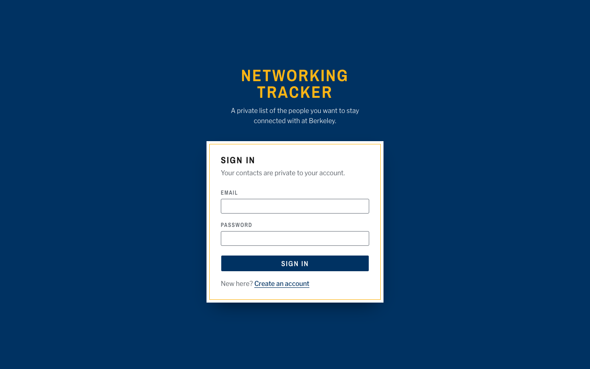
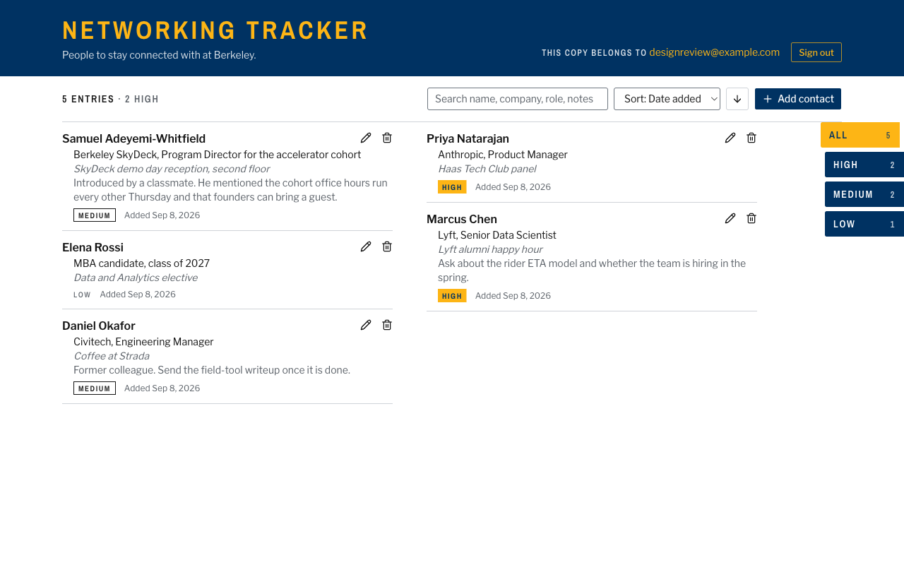
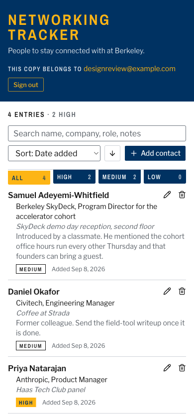
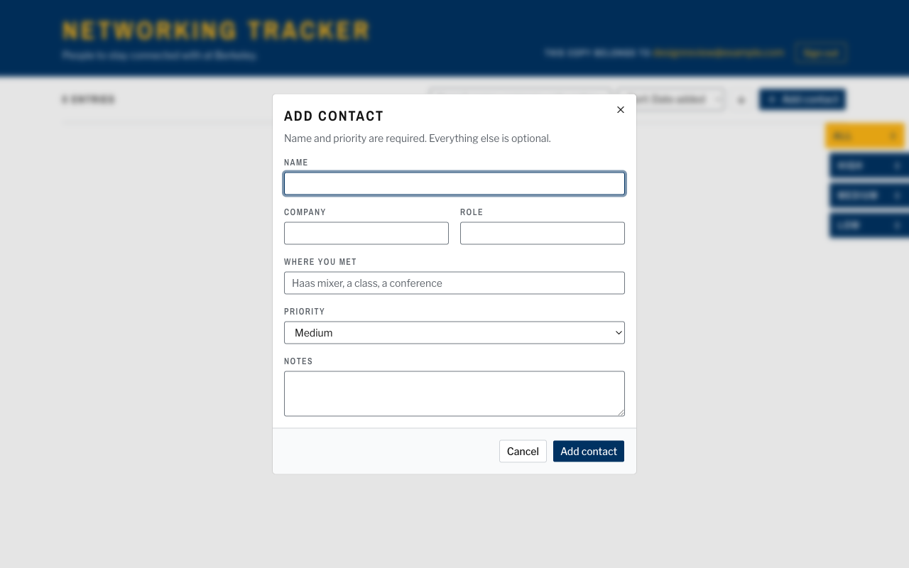
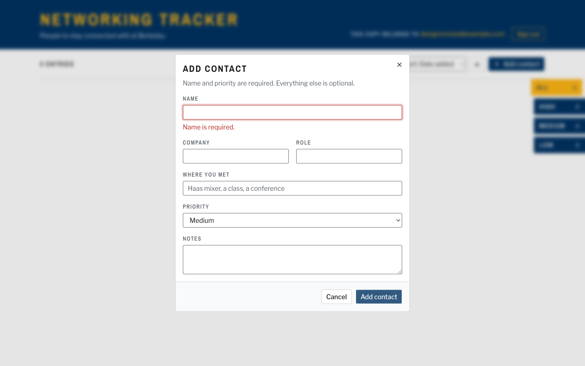
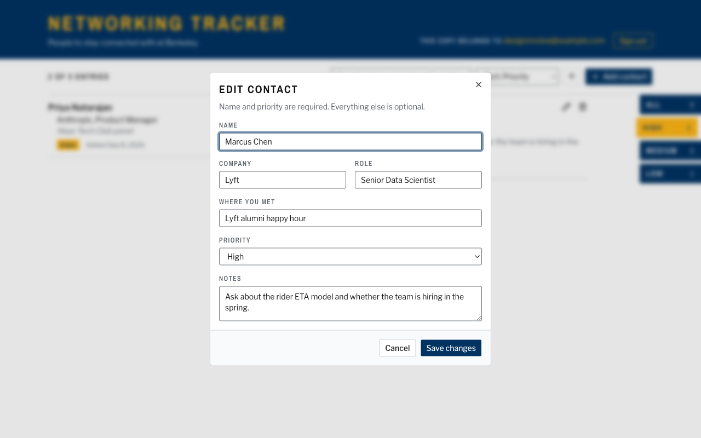
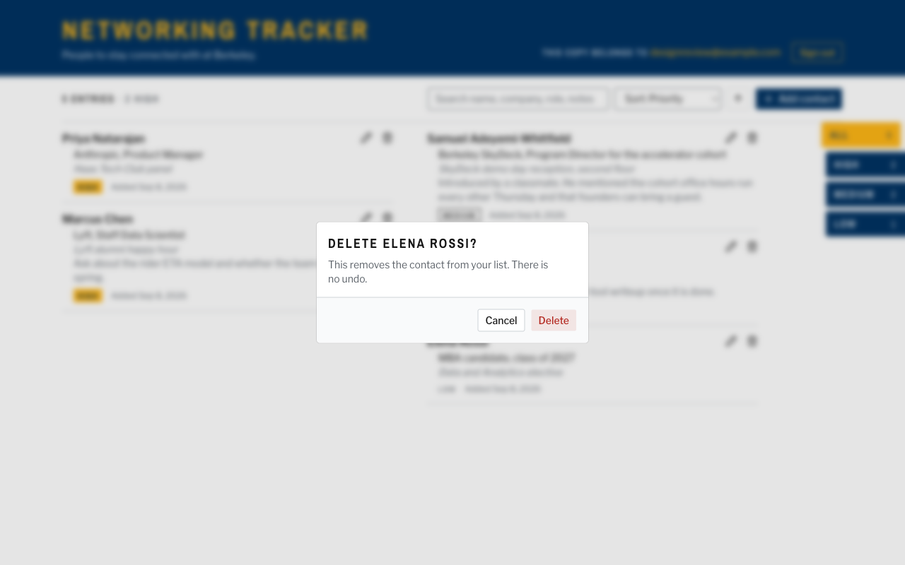
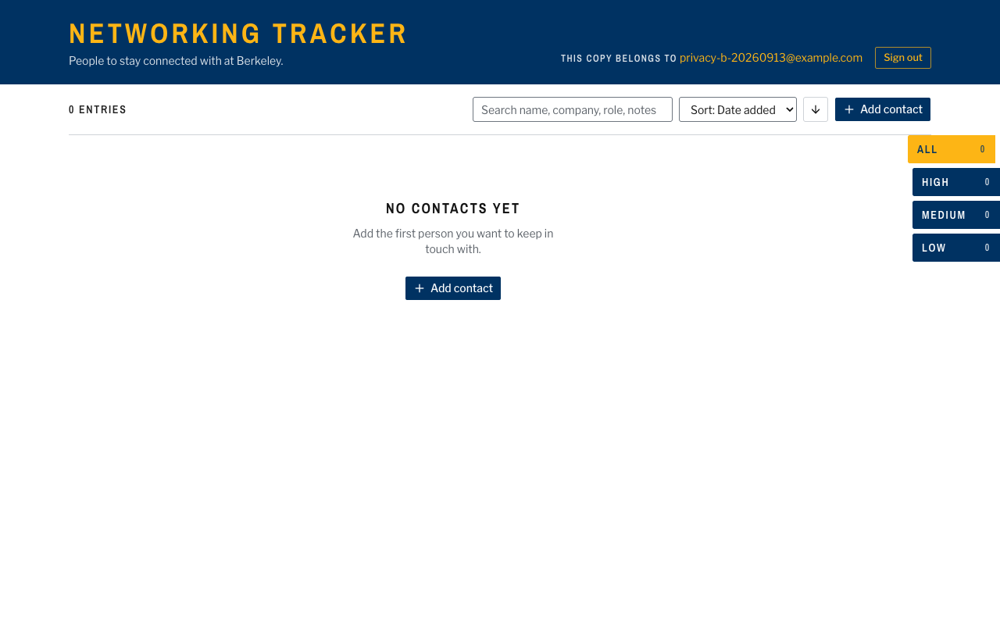

# Networking Tracker

I built this for Assignment 1 of Fundamentals of Agentic AI. It is a small web app for keeping a private list of the people I want to stay connected with at Berkeley, with a name, company, role, where we met, a note, and a priority for each person. Every account sees only its own contacts, and that promise is enforced inside Postgres with Row Level Security, so even a request that skips the UI and talks to the database API directly gets only the caller's rows. The stack is Next.js on Vercel, Neon Postgres, Neon's managed Better Auth, and the Neon Data API.

Live app: https://networking-tracker-lyart.vercel.app

## Screenshots

All screenshots are in `docs/screenshots`. Every one of them except the last was retaken on the live Vercel site on 2026-09-08, after the redesign described below, using a review account with a few seeded entries. The last one, User B's empty list, is from the original 2026-09-01 walkthrough and still shows the earlier look, because that account's password is not something I keep and the point of the picture is the empty list rather than the styling.

















## What it does

- Sign up, sign in, and sign out with email and password through Neon's managed Better Auth.
- Add a contact with name, company, role, where you met, notes, and a priority of high, medium, or low.
- View contacts as a directory listing that sorts by name, company, priority, or date added, and filters by search text and by priority.
- Edit and delete your own contacts, with a confirmation step before a delete.
- Contacts live in Neon Postgres, so they survive a refresh, a new tab, or a different device.
- A blank name or a priority outside the allowed set fails with a clear message in the form, and fails again at the database if the form is bypassed.
- Loading, empty, success, and error states each have their own visible treatment.
- The layout works on a phone. Below 768px the two-column listing becomes one column and the priority filter moves under the running head.

## Technology stack and why

Next.js 16 with the App Router runs on Vercel, which is the assignment's required host and the path of least friction for a Next.js deploy. The UI uses shadcn/ui components on Tailwind CSS v4, which gave me accessible dialogs and inputs without writing them from scratch and without a heavy component library. On 2026-09-08 I replaced the default look with a visual system of its own, a Berkeley class directory with a blue and gold cover, white listing pages with hanging-indent entries, and the priority filter as a thumb index on the edge of the page. The tokens and rules behind it are written down in `DESIGN.md`, and the product context that shaped it is in `PRODUCT.md`. Neon Postgres holds the data, Neon's managed Better Auth issues sessions and JSON Web Tokens, and the Neon Data API exposes the contacts table over HTTPS as a PostgREST endpoint that the browser calls directly. I chose that shape because it keeps the trust boundary in the database, which is where the assignment wants it, and because it means the deployed app never holds a Postgres connection string at all. The single dependency for both auth and data is `@neondatabase/neon-js`. Tests run on Node's built-in test runner, which strips TypeScript types natively on Node 22.18 and later, so there is no test framework to install.

## Architecture

There is a frontend, a thin server layer, and a database, and the browser cannot skip the protection in any of them.

```
Browser (Next.js client components, shadcn/ui)
  |
  |  1. sign in / sign up / sign out / get token      2. read and write contacts
  v                                                    v
Next.js server on Vercel                              Neon Data API (PostgREST)
  /api/auth/[...path]  ->  proxies to Neon Auth         Authorization: Bearer <JWT>
  proxy.ts             ->  guards "/" by session         |
  first-party HttpOnly cookie signed with               v
  NEON_AUTH_COOKIE_SECRET                              Neon Postgres
                                                        contacts table, CHECK constraints,
                                                        Row Level Security on auth.user_id()
```

The frontend is a set of client components. The contacts page loads rows, sorts and filters them in memory, lays them out as directory entries in two columns on a laptop and one on a phone, and opens a dialog for add and edit. The sign-in and sign-up pages are one shared form.

The server layer is Neon's Next.js auth adapter. The route handler at `app/api/auth/[...path]/route.ts` proxies every auth call to Neon's managed Better Auth service and rewrites the returned session cookie so it is first-party, HttpOnly, and signed with a secret that only the server knows. I route sign-in through that proxy because a cookie set by Neon's own domain is a third-party cookie from the app's point of view, and Safari and Chrome's private windows drop those, which would have logged a grader out on refresh. The `proxy.ts` middleware checks that cookie before the contacts page renders and redirects to the sign-in page otherwise.

The database is where ownership lives. When the browser needs to read or write contacts it first asks its own server for a short-lived JWT at `/api/auth/token`, which the proxy fetches from Neon Auth using the session cookie. The Data API client in `lib/neon.ts` caches that token until shortly before it expires and attaches it as a bearer token on every request. The Data API validates the signature against Neon Auth's public keys, connects to Postgres as the `authenticated` role, and exposes the token's `sub` claim through `auth.user_id()`. Every policy on the contacts table compares that value to the row's `user_id`, so a query can only ever see or change the caller's rows.

Hosting is Vercel for the Next.js app and Neon for everything else. The Vercel project holds three environment variables, the two public Neon URLs and the cookie secret. It does not hold `DATABASE_URL`, because nothing in the running app opens a direct database connection.

## Local setup

You need Node 22.18 or later, npm, and a Neon account.

1. Clone the repository and install dependencies.

   ```
   git clone https://github.com/IsaacAVazquez/Fundamentals-of-Agentic-AI.git
   cd Fundamentals-of-Agentic-AI/assignment-01
   npm install
   ```

2. Create a Neon project, enable managed Better Auth, and enable the Data API with the Neon Auth provider. The Neon CLI does all three, or you can click through the console under Auth and Data API for the branch.

   ```
   npx neon@latest auth
   npx neon projects create --name networking-tracker --set-context
   npx neon neon-auth enable
   npx neon data-api create --database neondb --auth-provider neon_auth --add-default-grants
   ```

   The second command prints the Auth URL and the third prints the Data API URL. `npx neon connection-string` prints the Postgres connection string used only for the next step.

3. Copy `.env.example` to `.env.local` and fill in the values. Generate the cookie secret with `openssl rand -base64 32`.

4. Create the contacts table, its constraints, and its RLS policies. The script runs `db/schema.sql` against `DATABASE_URL` and is safe to run more than once.

   ```
   npm run db:migrate
   ```

5. Tell Neon Auth to accept sign-ins from your local origin, then start the app and open http://localhost:3000.

   ```
   npx neon neon-auth domain add http://localhost:3000
   npm run dev
   ```

## Environment variables

Real values live in `.env.local`, which is ignored by Git. `.env.example` holds placeholders only.

| Name | Where it is used | Notes |
| --- | --- | --- |
| `NEXT_PUBLIC_NEON_AUTH_URL` | Server (auth proxy) | HTTPS endpoint of Neon Auth for the branch. Public by design. |
| `NEXT_PUBLIC_NEON_DATA_API_URL` | Browser | HTTPS endpoint of the Data API. Public by design, RLS protects the rows. |
| `NEON_AUTH_COOKIE_SECRET` | Server only | Signs the session cookie. At least 32 characters. Never in the browser bundle. |
| `DATABASE_URL` | Local only | Used by `npm run db:migrate` and the optional database test. Not set on Vercel. |

`NEON_AUTH_BASE_URL` from the assignment's list is not needed here because the server reads the same public Auth URL.

## Database schema

The full definition is in `db/schema.sql`. The table is `contacts`.

| Column | Type | Constraints | Purpose |
| --- | --- | --- | --- |
| `id` | `uuid` | primary key, default `gen_random_uuid()` | Row identifier |
| `user_id` | `text` | not null, default `auth.user_id()` | Owner. Filled by Postgres from the JWT, never sent by the app |
| `name` | `text` | not null, `check (length(btrim(name)) > 0)` | Person's name |
| `company` | `text` | nullable | Where they work |
| `role` | `text` | nullable | What they do |
| `where_met` | `text` | nullable | Where we met |
| `notes` | `text` | nullable | Free text |
| `priority` | `text` | not null, `check (priority in ('high', 'medium', 'low'))` | How important it is to stay in touch |
| `created_at` | `timestamptz` | not null, default `now()` | When the row was added |

There is an index on `user_id` because every query filters on it through RLS.

## Authentication and row ownership

Sign-up and sign-in go through Neon's managed Better Auth by way of the app's own `/api/auth` proxy. A successful sign-in produces two things. The first is a session cookie that lives on the app's domain, is HttpOnly, and is signed with `NEON_AUTH_COOKIE_SECRET`. The second, fetched on demand, is a JWT whose `sub` claim is the user's id and whose `role` claim is `authenticated`.

The contacts table has Row Level Security enabled and four separate policies, one each for select, insert, update, and delete, all scoped to the `authenticated` role and all built on the same rule, `auth.user_id() = user_id`. The select and delete policies use that rule in `USING`, so rows belonging to anyone else are invisible and undeletable. The insert policy uses it in `WITH CHECK`, so a new row must carry the caller's id, and since the app never sends `user_id` at all, the column default fills it from the token. The update policy uses the rule in both `USING` and `WITH CHECK`, which means a user can only touch their own rows and cannot change `user_id` to hand a row to someone else.

The Data API is the only path from the browser into Postgres, and it always connects as `authenticated`, so those policies apply to every request the app makes. The migration script connects as the table owner over `DATABASE_URL`, which bypasses RLS, and that is exactly why that string stays on my machine and is never given to Vercel.

Validation has two layers on purpose. `lib/contacts.ts` checks the name and priority in the browser so the form can show a specific message next to the field, and the `NOT NULL` and `CHECK` constraints in the schema enforce the same rules in the database so a crafted request fails too. The UI maps the Postgres error codes for a check violation, a missing required value, and an RLS denial to plain sentences.

## Tests

```
npm test
```

The test file is `tests/contacts.test.ts` and it runs on Node's built-in runner. Four cases cover `validateContact`. They verify that a valid contact is accepted with text trimmed and blanks stored as null, that an empty or whitespace-only name is rejected with the message the form shows, that a priority outside high, medium, and low is rejected, and that over-long fields are rejected. A fifth case connects to the database when `DATABASE_URL` is set and proves the `CHECK` constraints reject a blank name and an invalid priority at the Postgres level. Without `DATABASE_URL` that case is skipped, so the suite still passes on a machine without credentials.

Output from my machine on 2026-09-01, with `DATABASE_URL` set:

```
$ npm test
✔ accepts a valid contact, trims text, and stores blanks as null (0.345375ms)
✔ rejects an empty or whitespace-only name (0.063791ms)
✔ rejects a priority outside high, medium, and low (0.062542ms)
✔ rejects fields past their length limits (0.08125ms)
✔ database CHECK constraints reject a blank name and an invalid priority (223.121542ms)
ℹ tests 5
ℹ suites 0
ℹ pass 5
ℹ fail 0
ℹ cancelled 0
ℹ skipped 0
ℹ todo 0
ℹ duration_ms 325.291167
```

## Deployment

I deployed with the Vercel CLI from inside `assignment-01`, which is why the repository's root does not need a Vercel configuration.

```
vercel link
vercel env add NEXT_PUBLIC_NEON_AUTH_URL production --type config
vercel env add NEXT_PUBLIC_NEON_DATA_API_URL production --type config
vercel env add NEON_AUTH_COOKIE_SECRET production
vercel --prod
```

The two public variables need `--type config` because the Vercel CLI otherwise refuses to store a `NEXT_PUBLIC_` value that looks like a credential. After the first deploy the production domain has to be added to Neon Auth's trusted domains, otherwise sign-in from the live site is refused. The unique per-deployment URL that the CLI prints sits behind Vercel's deployment protection, so the production alias is the one to use and to trust.

```
npx neon neon-auth domain add https://networking-tracker-lyart.vercel.app
```

Importing the repository in the Vercel dashboard works too. Set the root directory to `assignment-01` and add the same three variables.

## Evidence

Everything in this section was run against the live URL on 2026-09-01 with two accounts I created for the purpose, usera@example.com and userb@example.com. User A owns two contacts and User B owns none.

Sign-in and sign-out are in `prod-01-sign-in.png` (the form on the live site) and `prod-04-signed-out.png` (the redirect back to it after clicking Sign out). Creating, editing, deleting, and refreshing a contact run from `04-add-dialog.png` through `12-after-delete.png`, and `06-after-refresh.png` is the list after a full page reload with all three rows still there. `03-invalid-name.png` is the form refusing a blank name. `prod-02-contacts.png` is User A's list on the live site and `prod-05-user-b-empty.png` is User B's, signed in on the same site a minute later.

The stronger proof for the two-account requirement is the transcript below, because it skips the UI entirely and talks to the Data API with each user's real JWT. Each user signs in through the app's own `/api/auth` proxy, fetches a JWT from `/api/auth/token`, and then calls the Data API directly. The password and the tokens are redacted, and the JWT claims are printed so the `sub` and `role` values are visible. Marcus Chen is a contact that belongs to User A.

```
# Sign in as User A through the app's auth proxy, then fetch A's JWT
$ curl -c jar -H 'Content-Type: application/json' -d '{"email":"usera@example.com","password":"<password>"}' https://networking-tracker-lyart.vercel.app/api/auth/sign-in/email
$ curl -b jar https://networking-tracker-lyart.vercel.app/api/auth/token   # -> {"token":"<jwt>"}
  JWT claims for A: {"sub":"2e45850a-8719-4bb5-9142-501d5011629c","role":"authenticated"}

$ GET contacts as A (own rows)
[{"id":"a976c0a3-735d-40f4-8d77-a6afd586078d","name":"Priya Natarajan","user_id":"2e45850a-8719-4bb5-9142-501d5011629c"}, 
 {"id":"ec534c09-04a8-40ae-852c-a2a9c26e7254","name":"Marcus Chen","user_id":"2e45850a-8719-4bb5-9142-501d5011629c"}]
  -> HTTP 200

# Sign in as User B the same way, then try to reach A's row (Marcus Chen, id ec534c09-04a8-40ae-852c-a2a9c26e7254)
  JWT claims for B: {"sub":"a19f77b6-1132-4907-8988-8a0a659b6c57","role":"authenticated"}

$ GET all contacts as B
[]
  -> HTTP 200

$ GET A's row by id as B
[]
  -> HTTP 200

$ PATCH A's row as B
[]
  -> HTTP 200

$ DELETE A's row as B
[]
  -> HTTP 200

$ POST a row owned by A as B
{"code":"42501","message":"new row violates row-level security policy for table \"contacts\"","details":null,"hint":null}
  -> HTTP 403

$ POST an invalid priority as B
{"code":"23514","message":"new row for relation \"contacts\" violates check constraint \"contacts_priority_check\"","details":null,"hint":null}
  -> HTTP 400

$ POST a blank name as B
{"code":"23514","message":"new row for relation \"contacts\" violates check constraint \"contacts_name_check\"","details":null,"hint":null}
  -> HTTP 400

$ GET contacts with no token
{"message":"missing authentication credentials: required authorization bearer token in JWT format","code":null,"detail":null,"hint":null}
  -> HTTP 400

# A's row afterwards, read as A
$ GET A's row by id as A
[{"id":"ec534c09-04a8-40ae-852c-a2a9c26e7254","name":"Marcus Chen","user_id":"2e45850a-8719-4bb5-9142-501d5011629c"}]
  -> HTTP 200
```

What that shows is that B's reads come back as an empty array with no error, because Row Level Security filters rows silently, and that B's PATCH and DELETE against A's row report zero affected rows for the same reason. Planting a row under A's id is the one case that fails loudly, with Postgres error 42501, because the insert policy's WITH CHECK runs before the row exists. The two invalid inserts fail on the CHECK constraints with error 23514, which is the database enforcing the same validation the form does. A request with no token at all is refused before it reaches Postgres. The last call shows A's row unchanged after all of that.

The repository holds no secret values. `.env.local` is ignored by Git, `.env.example` has placeholders only, and `DATABASE_URL` was never added to Vercel. Before pushing I searched the working tree and the full Git history for the connection string, the cookie secret, and any real Neon credential, and the only matches are the placeholders.

## Known limitations and what I would improve next

There is no email verification and no password reset, so a typo in an email address at sign-up creates an account nobody can recover. Sorting and filtering happen in the browser over the full list, which is fine for a personal contact list but would need server-side ordering and pagination past a few thousand rows, and the Data API's default row cap would start to bite before then. The server caches session data in a signed cookie for up to five minutes, so signing out in one browser does not instantly invalidate another. The table has no `updated_at` column, so there is no way to sort by last edit. If I kept going, the first things I would add are a scripted version of the two-account privacy check so it runs in CI instead of by hand, generated TypeScript types for the table from the Neon CLI, and a note-taking area on each contact for follow-ups.
