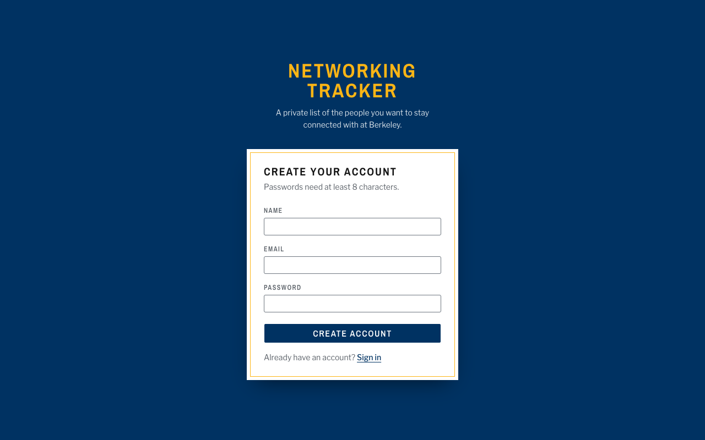
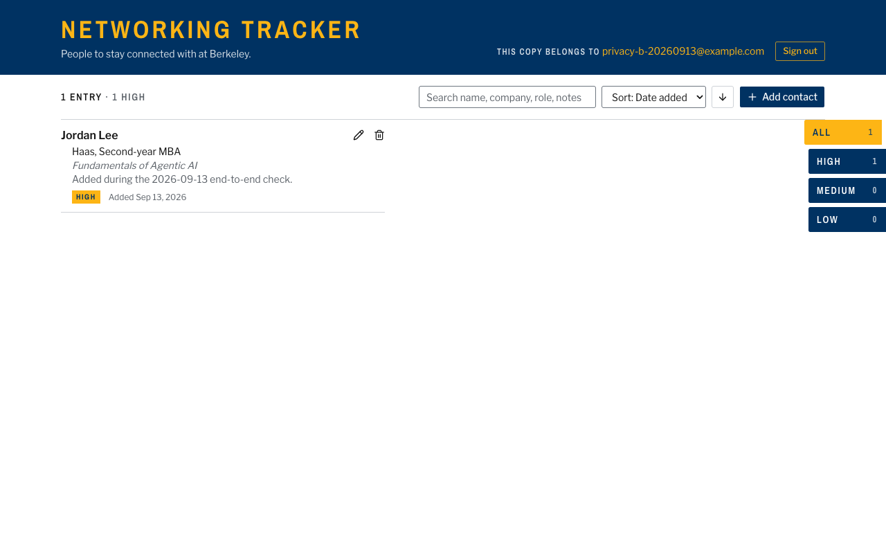
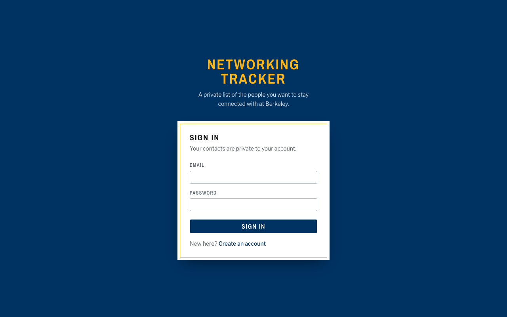
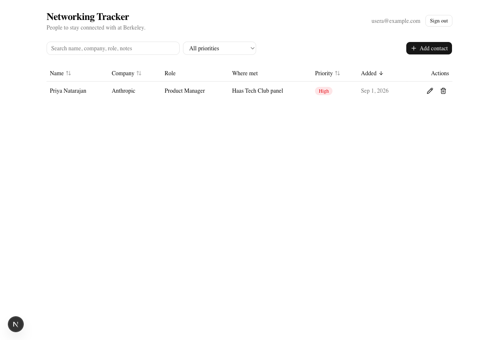
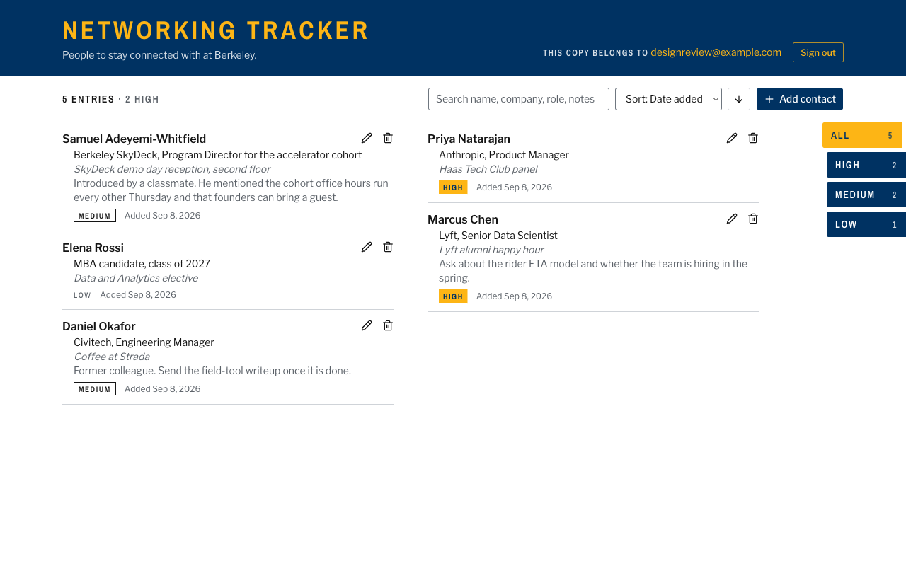
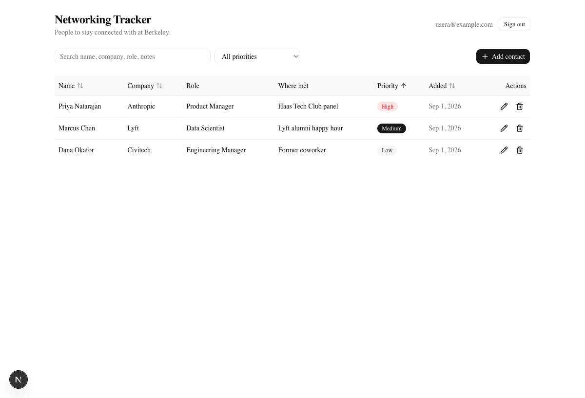
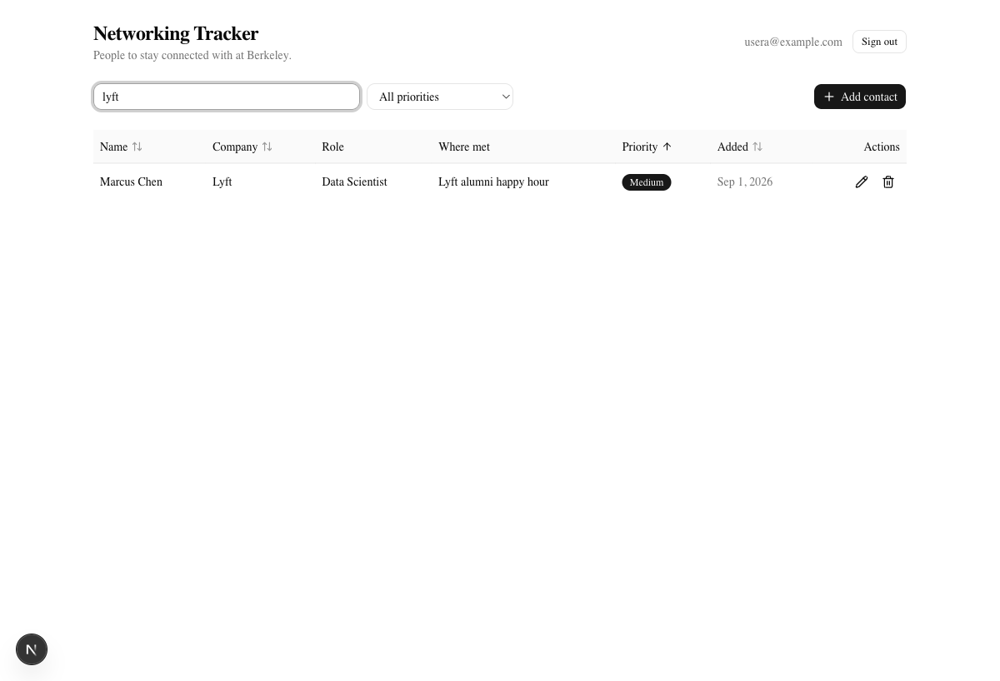
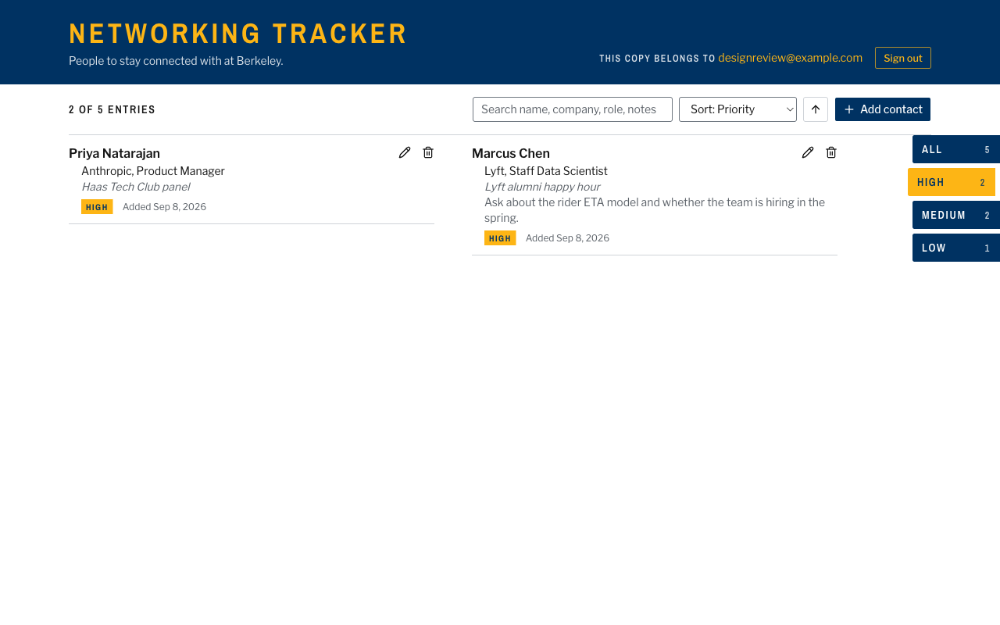
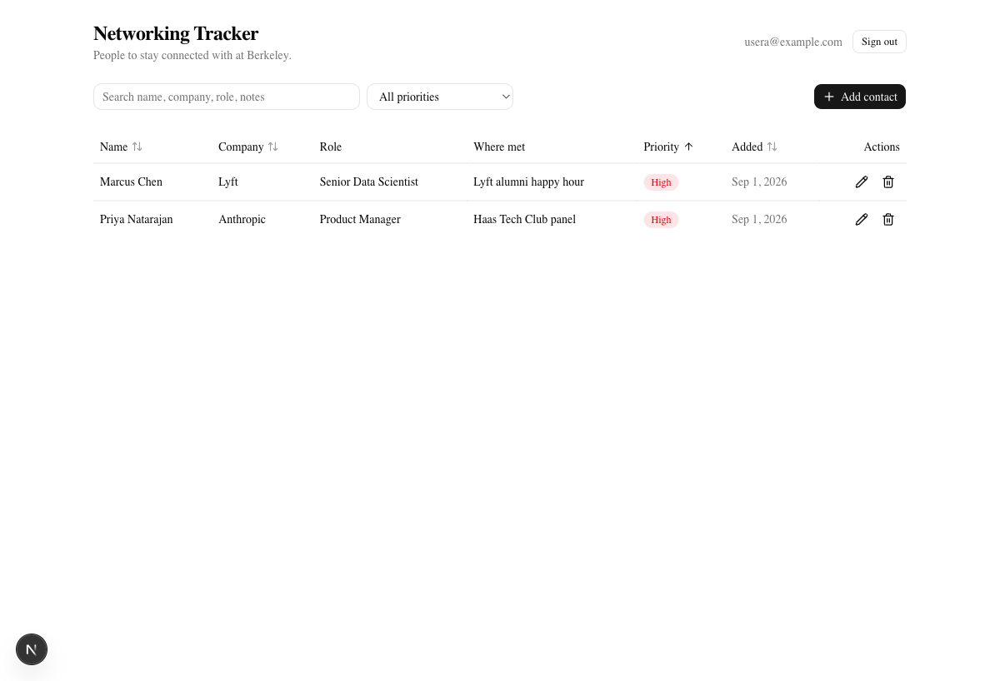

# Networking Tracker

I built this for Assignment 1 of Fundamentals of Agentic AI. It is a small web app for keeping a private list of the people I want to stay connected with at Berkeley, with a name, company, role, where we met, a note, and a priority for each person. Every account sees only its own contacts, and that promise is enforced inside Postgres with Row Level Security, so even a request that skips the UI and talks to the database API directly gets only the caller's rows. The stack is Next.js on Vercel, Neon Postgres, Neon's managed Better Auth, and the Neon Data API.

Live app: https://networking-tracker-lyart.vercel.app

## Where to find each requirement

The sections below follow the order of the assignment's README requirements. This table is the short version for anyone grading against the rubric.

| Requirement | Where it is |
| --- | --- |
| Live Vercel URL | Above, and again under Deployment |
| Screenshots or walkthrough | Walkthrough |
| Feature list | What it does |
| Technology stack and why | Technology stack and why |
| Architecture summary | Architecture |
| Local setup through `npm run dev` | Local setup |
| Environment variable names | Environment variables |
| Publishable versus secret values | Environment variables |
| Schema with every column | Database schema |
| Authentication and RLS ownership | Authentication and row ownership |
| Test command and what it verifies | Tests |
| Deployment instructions | Deployment |
| Known limitations | Known limitations and what I would improve next |
| Grading evidence | Evidence, which maps each required artifact to a file or transcript |

## Walkthrough

All screenshots are in `docs/screenshots`, and every one of them was taken on the live Vercel site. The sign-up form and the contact screens come from 2026-09-08, after the redesign described under Technology stack, using a review account. On that account I added one contact through the form, added four more, and then sorted, filtered, edited, and deleted. The sign-in, sign-out, and second-account screens come from a separate test account on 2026-09-13.

### Sign up, sign in, and sign out



The next three were taken seconds apart on 2026-09-13 with the test account privacy-b-20260913@example.com. They run from the filled sign-in form, to the list the app opens after sign-in with that email next to Sign out in the header, to the sign-in page the app went back to after I clicked Sign out. Loading `/` again at that point redirected straight back to the sign-in page and `/api/auth/token` answered 401, so the session was actually gone.






### Adding a contact and surviving a refresh

On the review account these go from the empty list a new account starts with, to the add dialog with name and priority required, to the first saved contact, to the full list after a hard page reload, with all five entries still there because they live in Postgres.






### Sorting and filtering

The first is the list sorted by priority with high first, and the second is the list filtered to high priority through the thumb index on the right edge, which leaves 2 of 5 entries.





### Editing and deleting

The edit dialog opens with the contact's current values, and after saving, Marcus Chen's role reads Staff Data Scientist instead of Senior Data Scientist. Deleting asks for confirmation first, and afterwards the list is down to four entries and the low priority count is zero.







### Invalid input

Saving with a blank name keeps the dialog open and shows the message under the field. A priority outside high, medium, and low cannot be picked in the form at all, so that case is shown under Evidence, where Postgres rejects it.


### A phone viewport

At 390px wide the listing drops to one column and the priority filter moves under the running head.


### A second account

This is User B, the 2026-09-13 test account, right after it was created on the live site. The list is empty even though User A, the review account, had four contacts at that moment. The stronger proof that accounts are isolated is the Data API transcript under Evidence, which skips the UI entirely and runs in both directions.


## What it does

- Sign up, sign in, and sign out with email and password through Neon's managed Better Auth.
- Add a contact with name, company, role, where you met, notes, and a priority of high, medium, or low.
- View contacts as a directory listing that sorts by name, company, priority, or date added, in either direction, and filters by search text and by priority.
- Edit and delete your own contacts, with a confirmation step before a delete.
- Contacts live in Neon Postgres, so they survive a refresh, a new tab, or a different device.
- A blank name or a priority outside the allowed set fails with a clear message in the form, and fails again at the database if the form is bypassed.
- Loading, empty, no-match, success, and error states each have their own visible treatment.
- The layout works on a phone. Below 768px the two-column listing becomes one column and the priority filter moves under the running head.

## Technology stack and why

Next.js 16 with the App Router runs on Vercel, which is the assignment's required host and the path of least friction for a Next.js deploy. The UI uses shadcn/ui components on Tailwind CSS v4, which gave me accessible dialogs and inputs without writing them from scratch and without a heavy component library. On 2026-09-08 I replaced the default look with a visual system of its own, a Berkeley class directory with a blue and gold cover, white listing pages with hanging-indent entries, and the priority filter as a thumb index on the edge of the page. The tokens and rules behind it are written down in `DESIGN.md`, and the product context that shaped it is in `PRODUCT.md`.

Neon Postgres holds the data, Neon's managed Better Auth issues sessions and JSON Web Tokens, and the Neon Data API exposes the contacts table over HTTPS as a PostgREST endpoint that the browser calls directly. I chose that shape because it keeps the trust boundary in the database, which is where the assignment wants it, and because it means the deployed app never holds a Postgres connection string at all. The single dependency for both auth and data is `@neondatabase/neon-js`. Tests run on Node's built-in test runner, which strips TypeScript types natively on Node 22.18 and later, so there is no test framework to install.

## Architecture

There is a frontend, a thin server layer, and a database, and the browser cannot skip the protection in any of them.

```
Browser (Next.js client components, shadcn/ui)
  |
  |  1. sign in / sign up / sign out / get token      2. read and write contacts
  v                                                    v
Next.js server on Vercel                              Neon Data API (PostgREST)
  /api/auth/[...path]  ->  proxies to Neon Auth         Authorization: Bearer <JWT>
  proxy.ts             ->  guards "/" by session         |
  first-party HttpOnly cookie signed with               v
  NEON_AUTH_COOKIE_SECRET                              Neon Postgres
                                                        contacts table, CHECK constraints,
                                                        Row Level Security on auth.user_id()
```

The frontend is a set of client components. The contacts page in `components/contacts-page.tsx` loads rows, sorts and filters them in memory, lays them out as directory entries in two columns on a laptop and one on a phone, and opens a dialog for add and edit. The sign-in and sign-up pages share one form.

The server layer is Neon's Next.js auth adapter. The route handler at `app/api/auth/[...path]/route.ts` proxies every auth call to Neon's managed Better Auth service and rewrites the returned session cookie so it is first-party, HttpOnly, and signed with a secret that only the server knows. I route sign-in through that proxy because a cookie set by Neon's own domain is a third-party cookie from the app's point of view, and Safari and Chrome's private windows drop those, which would have logged a grader out on refresh. The `proxy.ts` middleware checks that cookie before the contacts page renders and redirects to the sign-in page otherwise.

The database is where ownership lives. When the browser needs to read or write contacts it first asks its own server for a short-lived JWT at `/api/auth/token`, which the proxy fetches from Neon Auth using the session cookie. The Data API client in `lib/neon.ts` caches that token until shortly before it expires and attaches it as a bearer token on every request. The Data API validates the signature against Neon Auth's public keys, connects to Postgres as the `authenticated` role, and exposes the token's `sub` claim through `auth.user_id()`. Every policy on the contacts table compares that value to the row's `user_id`, so a query can only ever see or change the caller's rows.

Hosting is Vercel for the Next.js app and Neon for everything else. The Vercel project holds three environment variables, the two public Neon URLs and the cookie secret. It does not hold `DATABASE_URL`, because nothing in the running app opens a direct database connection.

## Database schema

The full definition is in `db/schema.sql`. The table is `contacts`.

| Column | Type | Constraints | Purpose |
| --- | --- | --- | --- |
| `id` | `uuid` | primary key, default `gen_random_uuid()` | Row identifier |
| `user_id` | `text` | not null, default `auth.user_id()` | Owner. Filled by Postgres from the JWT, never sent by the app |
| `name` | `text` | not null, `check (length(btrim(name)) > 0)` | Person's name |
| `company` | `text` | nullable | Where they work |
| `role` | `text` | nullable | What they do |
| `where_met` | `text` | nullable | Where we met |
| `notes` | `text` | nullable | Free text |
| `priority` | `text` | not null, `check (priority in ('high', 'medium', 'low'))` | How important it is to stay in touch |
| `created_at` | `timestamptz` | not null, default `now()` | When the row was added |

There is an index on `user_id` because every query filters on it through RLS.

## Authentication and row ownership

Sign-up and sign-in go through Neon's managed Better Auth by way of the app's own `/api/auth` proxy. A successful sign-in produces two things. The first is a session cookie that lives on the app's domain, is HttpOnly, and is signed with `NEON_AUTH_COOKIE_SECRET`. The second, fetched on demand, is a JWT whose `sub` claim is the user's id and whose `role` claim is `authenticated`.

The contacts table has Row Level Security enabled and four separate policies, one each for select, insert, update, and delete, all scoped to the `authenticated` role and all built on the same rule, `auth.user_id() = user_id`. The select and delete policies use that rule in `USING`, so rows belonging to anyone else are invisible and undeletable. The insert policy uses it in `WITH CHECK`, so a new row must carry the caller's id, and since the app never sends `user_id` at all, the column default fills it from the token. The update policy uses the rule in both `USING` and `WITH CHECK`, which means a user can only touch their own rows and cannot change `user_id` to hand a row to someone else.

The Data API is the only path from the browser into Postgres, and it always connects as `authenticated`, so those policies apply to every request the app makes. The migration script connects as the table owner over `DATABASE_URL`, which bypasses RLS, and that is exactly why that string stays on my machine and is never given to Vercel.

Validation has two layers on purpose. `lib/contacts.ts` checks the name and priority in the browser so the form can show a specific message under the field, and the `NOT NULL` and `CHECK` constraints in the schema enforce the same rules in the database so a crafted request fails too. The UI maps the Postgres error codes for a check violation, a missing required value, and an RLS denial to plain sentences.

## Tests

```
npm test
```

The test file is `tests/contacts.test.ts` and it runs on Node's built-in runner. Four cases cover `validateContact`. They verify that a valid contact is accepted with text trimmed and blanks stored as null, that an empty or whitespace-only name is rejected with the message the form shows, that a priority outside high, medium, and low is rejected, and that over-long fields are rejected. A fifth case connects to the database when `DATABASE_URL` is set and proves the `CHECK` constraints reject a blank name and an invalid priority at the Postgres level. Without `DATABASE_URL` that case is skipped, so the suite still passes on a machine without credentials.

Output from my machine on 2026-09-08, with `DATABASE_URL` set:

```
$ npm test
✔ accepts a valid contact, trims text, and stores blanks as null (0.554167ms)
✔ rejects an empty or whitespace-only name (0.075958ms)
✔ rejects a priority outside high, medium, and low (0.06975ms)
✔ rejects fields past their length limits (0.089125ms)
✔ database CHECK constraints reject a blank name and an invalid priority (393.928292ms)
ℹ tests 5
ℹ suites 0
ℹ pass 5
ℹ fail 0
ℹ cancelled 0
ℹ skipped 0
ℹ todo 0
ℹ duration_ms 510.461
```

## Local setup

You need Node 22.18 or later, npm, and a Neon account.

1. Clone the repository and install dependencies.

   ```
   git clone https://github.com/IsaacAVazquez/Fundamentals-of-Agentic-AI.git
   cd Fundamentals-of-Agentic-AI/assignment-01
   npm install
   ```

2. Create a Neon project, enable managed Better Auth, and enable the Data API with the Neon Auth provider. The Neon CLI does all three, or you can click through the console under Auth and Data API for the branch.

   ```
   npx neon@latest auth
   npx neon projects create --name networking-tracker --set-context
   npx neon neon-auth enable
   npx neon data-api create --database neondb --auth-provider neon_auth --add-default-grants
   ```

   Once both are enabled, `npx neon neon-auth status` shows the Auth URL as its Base URL and `npx neon data-api get --database neondb` shows the Data API URL. `npx neon connection-string` prints the Postgres connection string used only for the migration step.

3. Copy `.env.example` to `.env.local` and fill in the values. Generate the cookie secret with `openssl rand -base64 32`.

4. Create the contacts table, its constraints, and its RLS policies. The script runs `db/schema.sql` against `DATABASE_URL` and is safe to run more than once.

   ```
   npm run db:migrate
   ```

5. Tell Neon Auth to accept sign-ins from your local origin, then start the app and open http://localhost:3000.

   ```
   npx neon neon-auth domain add http://localhost:3000
   npm run dev
   ```

## Environment variables

Real values live in `.env.local`, which is ignored by Git. `.env.example` holds placeholders only.

| Name | Where it is used | Notes |
| --- | --- | --- |
| `NEXT_PUBLIC_NEON_AUTH_URL` | Server (auth proxy) | HTTPS endpoint of Neon Auth for the branch. Public by design. |
| `NEXT_PUBLIC_NEON_DATA_API_URL` | Browser | HTTPS endpoint of the Data API. Public by design, RLS protects the rows. |
| `NEON_AUTH_COOKIE_SECRET` | Server only | Signs the session cookie. At least 32 characters. Never in the browser bundle. |
| `DATABASE_URL` | Local only | Used by `npm run db:migrate` and the optional database test. Not set on Vercel. |

`NEON_AUTH_BASE_URL` from the assignment's list is not needed here because the server reads the same public Auth URL.

### Publishable versus secret values

The two `NEXT_PUBLIC_` URLs are publishable. Next.js can put any variable with that prefix into the browser bundle, and these two only say where the Auth service and the Data API live, so knowing them does not get anyone past Row Level Security. The cookie secret and the connection string are secrets. The cookie secret is stored on Vercel as a Secret-type environment variable, and the only code that reads it is `lib/auth/server.ts`, which runs on the server. The connection string lives only in my local `.env.local`, since the only code that uses it is the migration script and the optional database test. On 2026-09-13 I ran a production build with all four values present and searched the 12 JavaScript files it generates for the browser, and none of them contains the cookie secret, the database password, or the names `DATABASE_URL` and `NEON_AUTH_COOKIE_SECRET`.

## Deployment

The app is live at https://networking-tracker-lyart.vercel.app. I deployed with the Vercel CLI from inside `assignment-01`, which is why the repository's root does not need a Vercel configuration.

```
vercel link
vercel env add NEXT_PUBLIC_NEON_AUTH_URL production --type config
vercel env add NEXT_PUBLIC_NEON_DATA_API_URL production --type config
vercel env add NEON_AUTH_COOKIE_SECRET production
vercel --prod
```

The two public variables need `--type config` because the Vercel CLI otherwise refuses to store a `NEXT_PUBLIC_` value that looks like a credential. After the first deploy the production domain has to be added to Neon Auth's trusted domains, otherwise sign-in from the live site is refused. The unique per-deployment URL that the CLI prints sits behind Vercel's deployment protection, so the production alias is the one to use and to trust.

```
npx neon neon-auth domain add https://networking-tracker-lyart.vercel.app
```

Importing the repository in the Vercel dashboard works too. Set the root directory to `assignment-01` and add the same three variables.

## Evidence

The assignment brief asks for seven specific artifacts, and the Definition of Done slide in the Class 2 deck adds an explanation of publishable versus secret values. This is where each one is.

| Required evidence | Where it is |
| --- | --- |
| Automated test output with a passing validation test | The `npm test` output under Tests, five passing, with the blank name and invalid priority cases checked in the validator and again in the database |
| Sign-in and sign-out | `prod-01-sign-in.png`, `prod-02-signed-in.png`, and `prod-04-signed-out.png` under Walkthrough |
| Creating, editing, deleting, and refreshing a contact | `04-add-dialog.png` through `12-after-delete.png` under Walkthrough, with `06-after-refresh.png` as the reload |
| Two accounts, neither can reach the other's contacts | The Data API transcript below, run in both directions, plus `prod-05-user-b-empty.png` |
| One invalid input failing safely | `03-invalid-name.png` in the form, and the two `23514` responses in the transcript at the database |
| The schema and the RLS ownership rule | Database schema and Authentication and row ownership above |
| Publishable versus secret values | Publishable versus secret values, under Environment variables |
| No committed secret values | The last paragraph of this section |

### Two-account privacy check

I ran this against the live URL on the evening of 2026-09-13 Pacific time, which is why the timestamp at the top reads 2026-09-14 in UTC. User A is designreview@example.com, the review account behind the walkthrough, which owned four contacts, and User B is privacy-b-20260913@example.com, which owned one. Each user signs in through the app's own `/api/auth` proxy and trades the session cookie for a JWT at `/api/auth/token`, and after that every request goes straight to the Data API with that token, so the UI plays no part. Passwords and tokens are left out, and the JWT claims are printed so the `sub` and `role` values are visible. Each account first adds a throwaway row so the other one has something to aim at, and both rows are deleted at the end.

```
Run 2026-09-14T01:43:59.453Z against https://networking-tracker-lyart.vercel.app
User A designreview@example.com, JWT claims {"sub":"afde7847-63c2-4eb5-8200-0cc3a17dead3","role":"authenticated"}
User B privacy-b-20260913@example.com, JWT claims {"sub":"785a4924-0862-4bc1-b4f9-ce8d14b6d364","role":"authenticated"}

$ A adds a row
  POST /contacts?select=id,name,user_id {"name":"Privacy check row A","priority":"low"}
  -> 201 [{"id":"c7921e07-7bb0-45c5-8ca7-be7fd96e06ff","name":"Privacy check row A","user_id":"afde7847-63c2-4eb5-8200-0cc3a17dead3"}]
$ B adds a row
  POST /contacts?select=id,name,user_id {"name":"Privacy check row B","priority":"low"}
  -> 201 [{"id":"483d076c-9590-4f1e-ae7c-3cffd9150c23","name":"Privacy check row B","user_id":"785a4924-0862-4bc1-b4f9-ce8d14b6d364"}]

# B tries to read, change, delete, and plant rows that belong to A
$ every contact B can see
  GET /contacts?select=id,name,user_id
  -> 200 [{"id":"04575ea8-d66b-4c3b-bd89-a05be8d69968","name":"Jordan Lee","user_id":"785a4924-0862-4bc1-b4f9-ce8d14b6d364"},{"id":"483d076c-9590-4f1e-ae7c-3cffd9150c23","name":"Privacy check row B","user_id":"785a4924-0862-4bc1-b4f9-ce8d14b6d364"}]
$ A's row by id, as B
  GET /contacts?select=id,name,user_id&id=eq.c7921e07-7bb0-45c5-8ca7-be7fd96e06ff
  -> 200 []
$ rename A's row, as B
  PATCH /contacts?select=id,name,user_id&id=eq.c7921e07-7bb0-45c5-8ca7-be7fd96e06ff {"name":"changed by B"}
  -> 200 []
$ delete A's row, as B
  DELETE /contacts?select=id,name,user_id&id=eq.c7921e07-7bb0-45c5-8ca7-be7fd96e06ff
  -> 200 []
$ insert a row owned by A, as B
  POST /contacts?select=id,name,user_id {"name":"Planted row","priority":"low","user_id":"afde7847-63c2-4eb5-8200-0cc3a17dead3"}
  -> 403 {"code":"42501","message":"new row violates row-level security policy for table \"contacts\"","details":null,"hint":null}
$ hand B's own row to A
  PATCH /contacts?select=id,name,user_id&id=eq.483d076c-9590-4f1e-ae7c-3cffd9150c23 {"user_id":"afde7847-63c2-4eb5-8200-0cc3a17dead3"}
  -> 403 {"code":"42501","message":"new row violates row-level security policy for table \"contacts\"","details":null,"hint":null}
$ A reads the row afterwards
  GET /contacts?select=id,name,user_id&id=eq.c7921e07-7bb0-45c5-8ca7-be7fd96e06ff
  -> 200 [{"id":"c7921e07-7bb0-45c5-8ca7-be7fd96e06ff","name":"Privacy check row A","user_id":"afde7847-63c2-4eb5-8200-0cc3a17dead3"}]

# A tries to read, change, delete, and plant rows that belong to B
$ every contact A can see
  GET /contacts?select=id,name,user_id
  -> 200 [{"id":"a14ba1cf-306e-4443-8d99-26c6dfe08cac","name":"Marcus Chen","user_id":"afde7847-63c2-4eb5-8200-0cc3a17dead3"},{"id":"1b88f2f0-8fac-4e71-af80-873623b22c80","name":"Priya Natarajan","user_id":"afde7847-63c2-4eb5-8200-0cc3a17dead3"},{"id":"bc1045fe-dbdc-402a-8a83-e8b04cb34338","name":"Daniel Okafor","user_id":"afde7847-63c2-4eb5-8200-0cc3a17dead3"},{"id":"67e5f7fa-a715-41dc-8e5f-66641f82d220","name":"Samuel Adeyemi-Whitfield","user_id":"afde7847-63c2-4eb5-8200-0cc3a17dead3"},{"id":"c7921e07-7bb0-45c5-8ca7-be7fd96e06ff","name":"Privacy check row A","user_id":"afde7847-63c2-4eb5-8200-0cc3a17dead3"}]
$ B's row by id, as A
  GET /contacts?select=id,name,user_id&id=eq.483d076c-9590-4f1e-ae7c-3cffd9150c23
  -> 200 []
$ rename B's row, as A
  PATCH /contacts?select=id,name,user_id&id=eq.483d076c-9590-4f1e-ae7c-3cffd9150c23 {"name":"changed by A"}
  -> 200 []
$ delete B's row, as A
  DELETE /contacts?select=id,name,user_id&id=eq.483d076c-9590-4f1e-ae7c-3cffd9150c23
  -> 200 []
$ insert a row owned by B, as A
  POST /contacts?select=id,name,user_id {"name":"Planted row","priority":"low","user_id":"785a4924-0862-4bc1-b4f9-ce8d14b6d364"}
  -> 403 {"code":"42501","message":"new row violates row-level security policy for table \"contacts\"","details":null,"hint":null}
$ hand A's own row to B
  PATCH /contacts?select=id,name,user_id&id=eq.c7921e07-7bb0-45c5-8ca7-be7fd96e06ff {"user_id":"785a4924-0862-4bc1-b4f9-ce8d14b6d364"}
  -> 403 {"code":"42501","message":"new row violates row-level security policy for table \"contacts\"","details":null,"hint":null}
$ B reads the row afterwards
  GET /contacts?select=id,name,user_id&id=eq.483d076c-9590-4f1e-ae7c-3cffd9150c23
  -> 200 [{"id":"483d076c-9590-4f1e-ae7c-3cffd9150c23","name":"Privacy check row B","user_id":"785a4924-0862-4bc1-b4f9-ce8d14b6d364"}]

# Invalid input and a missing token
$ priority outside high, medium, low
  POST /contacts?select=id,name,user_id {"name":"Bad priority","priority":"urgent"}
  -> 400 {"code":"23514","message":"new row for relation \"contacts\" violates check constraint \"contacts_priority_check\"","details":null,"hint":null}
$ blank name
  POST /contacts?select=id,name,user_id {"name":"   ","priority":"high"}
  -> 400 {"code":"23514","message":"new row for relation \"contacts\" violates check constraint \"contacts_name_check\"","details":null,"hint":null}
$ no token at all
  GET /contacts?select=id,name,user_id
  -> 400 {"message":"missing authentication credentials: required authorization bearer token in JWT format","code":null,"detail":null,"hint":null}

# Cleanup
$ A deletes its own check row
  DELETE /contacts?select=id,name,user_id&id=eq.c7921e07-7bb0-45c5-8ca7-be7fd96e06ff
  -> 200 [{"id":"c7921e07-7bb0-45c5-8ca7-be7fd96e06ff","name":"Privacy check row A","user_id":"afde7847-63c2-4eb5-8200-0cc3a17dead3"}]
$ B deletes its own check row
  DELETE /contacts?select=id,name,user_id&id=eq.483d076c-9590-4f1e-ae7c-3cffd9150c23
  -> 200 [{"id":"483d076c-9590-4f1e-ae7c-3cffd9150c23","name":"Privacy check row B","user_id":"785a4924-0862-4bc1-b4f9-ce8d14b6d364"}]

All privacy checks passed.
```

What that shows is that reading the other account's row comes back as an empty array with no error, because Row Level Security filters rows silently, and that the rename and delete attempts report zero affected rows for the same reason. The two attempts that fail loudly, with Postgres error 42501, are inserting a row under the other account's id and handing your own row to the other account, which are the `WITH CHECK` clauses on the insert and update policies refusing a row that would not belong to the caller. The two invalid inserts fail on the CHECK constraints with error 23514, which is the database enforcing the same validation the form does, and a request with no token at all is refused before it reaches Postgres. The last read in each block shows the target row unchanged, and the cleanup at the end is the only place a delete returns a row, because each account is deleting its own.

### No secrets in the repository

`.env.local` is ignored by Git, `.env.example` has placeholders only, and `DATABASE_URL` was never added to Vercel. Before pushing I searched the working tree and the full Git history for the connection string, the cookie secret, and any real Neon credential, and the only matches are the placeholders. I repeated that search on 2026-09-08 and again on 2026-09-13, with the same result both times.

## Known limitations and what I would improve next

There is no email verification and no password reset, so a typo in an email address at sign-up creates an account nobody can recover. Sorting and filtering happen in the browser over the full list, which is fine for a personal contact list but would need server-side ordering and pagination past a few thousand rows. The server caches session data in a signed cookie for up to five minutes, so signing out in one browser does not instantly invalidate another. The table has no `updated_at` column, so there is no way to sort by last edit. If I kept going, the first things I would add are a scripted version of the two-account privacy check so it runs in CI instead of by hand, generated TypeScript types for the table from the Neon CLI, and a dated follow-up log on each contact, since notes are a single free-text field today.
