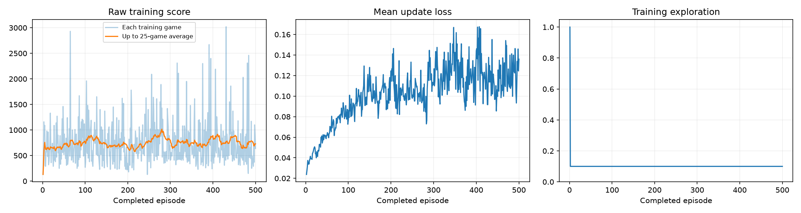
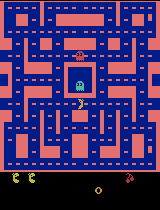
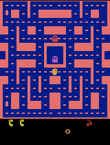
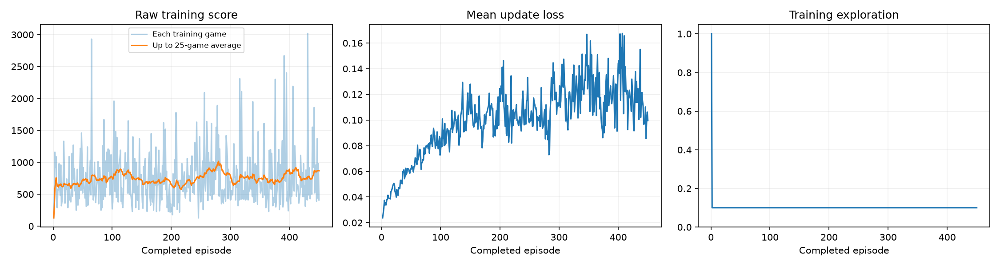

# Ms. Pac-Man DQN

I trained this agent for Assignment 2 of Fundamentals of Agentic AI. It's the course's Deep Q-Network notebook for Ms. Pac-Man, run on my laptop with 10% exploration and a learning rate of 0.0001. I ran it twice, and the only difference between the two runs is the number of training games. My first run trained for 500 games, and its final agent averaged 400 on the five evaluation games against 492 for the untrained network. When I replayed every checkpoint that run saved on games the notebook never uses, the agent saved after 450 games turned out to be far better than the one the run ended with, so I reran the notebook with 450 games. The notebook in this folder is that second run, executed start to finish with every output saved, and its agent averaged 946 on the same five evaluation games against 492 for the untrained network.

## Where to find each requirement

The sections below follow the order of the assignment's README requirements. This table is the short version for anyone grading against the brief.

| Requirement | Where it is |
| --- | --- |
| Overview and how to open and run the notebook | The paragraph above, and Open and run the notebook |
| Exploration, episodes, and learning rate, with a reason for each | My three choices |
| What I expected before training, then what I observed | What I expected before each run, and What happened |
| Completed episodes, decisions, learning updates, elapsed time, and hardware | Training budget and hardware |
| Observations, actions, and rewards in plain language | What the agent sees, does, and gets rewarded for |
| One observed limitation and one next experiment | One limitation and the next experiment |
| Untrained, best trained, and intermediate GIFs | Gameplay, under The final run |
| `training_dashboard.png` | Training dashboard, under The final run, with the first run's under The first run |
| All five baseline and trained scores, both means, and `comparison.json` | Evaluation scores, under The final run, with the first run's table under The first run |
| Links to the notebook, `config.json`, `training.csv`, and `training_summary.json`, and whether a run was interrupted | Training budget and hardware, and Files and checkpoints |

## Open and run the notebook

The executed notebook is [pacman_dqn.ipynb](pacman_dqn.ipynb), from the final 450-game run. It keeps every output from that run, including the baseline, all 450 training lines, the progress GIFs, the dashboard, and the final comparison, so none of it needs rerunning to inspect. The first run's executed notebook is [results/500-games/pacman_dqn_500_games.ipynb](results/500-games/pacman_dqn_500_games.ipynb), and I left its explanation cell at the end as the course's blank template, since this README covers both runs.

To run it again locally, clone the repository and set up Python 3.13 in this folder. I used `scripts/setup.sh`, which builds `.venv` with uv from Homebrew's Python 3.13 and installs `requirements.txt` plus the Jupyter pieces a scripted run needs. The course's own instructions use a plain virtual environment and pip instead, and either way the notebook's setup cell installs anything that's missing.

```
git clone https://github.com/IsaacAVazquez/Fundamentals-of-Agentic-AI.git
cd Fundamentals-of-Agentic-AI/assignment-02
scripts/setup.sh
scripts/lab.sh
```

`scripts/lab.sh` opens the notebook in JupyterLab, where Run All repeats the experiment. I ran mine without opening Jupyter's interface, using the command below, which executes every cell in order and writes the outputs back into the notebook. `caffeinate` only keeps the Mac awake until it finishes.

```
caffeinate -is .venv/bin/jupyter-nbconvert --to notebook --execute --inplace --allow-errors \
  --ExecutePreprocessor.kernel_name=python3 --ExecutePreprocessor.timeout=-1 pacman_dqn.ipynb
```

In Colab, the route from the Class 3 setup slide is File, then Upload notebook, then Run all. Any rerun starts a fresh experiment in a new `pacman_runs/` folder and replaces the outputs saved in the notebook, and the notebook itself notes that GPU results can vary even with fixed seeds, so a rerun on different hardware may not reproduce my scores exactly.

`scripts/verify.sh` runs the course's five-game check without touching the notebook, and I ran it on 2026-09-13 before the real runs, when it passed in about 20 seconds. `scripts/check_checkpoints.py` replays a finished run's saved agents on games the notebook never plays, which is how I chose 450 games. It took about nine and a half minutes on this laptop.

```
.venv/bin/python scripts/check_checkpoints.py pacman_runs/<run folder>
```

## My three choices

| Setting | Starting value | First run | Final run |
| --- | --- | --- | --- |
| Exploration | 0.20 | 0.10 | 0.10 |
| Episodes | 100 | 500 | 450 |
| Learning rate | 0.0001 | 0.0001 | 0.0001 |

Everything else is exactly as the course ships it, including the five evaluation seeds, the 5% random moves during evaluation, and the cap of 3,000 decisions per game.

I set exploration to 0.10, so one training move in ten is random once the 1,000-move warm-up is over. The course's build-from-scratch prompt decays exploration toward 0.1, and a lower rate keeps practice closer to the way the agent gets scored, since evaluation uses 5% random moves.

I kept the learning rate at 0.0001. It's the notebook's reference value and the rate the course's build-from-scratch prompt starts Adam at, and with a replay memory of only 5,000 decisions I wanted steady updates more than fast ones.

For the first run I picked 500 episodes because a five-game run only checks the setup, and on this laptop 500 games looked like roughly 20 to 35 minutes, which I thought was long enough for learning to show up in the evaluation games the class leaderboard uses. For the final run I changed episodes to 450 and nothing else, because of what I found when I checked the first run's checkpoints, which is laid out under What happened.

## What I expected before each run

I recorded both predictions before the runs started. Before the first run, I expected a clear gain over the untrained network, whose five-game average had been 492 in the 9/8 and 9/9 setup checks, but with a lot of swing from one game to the next. My reasoning was that 500 games is a hundred times the five-game check, where the trained agent actually scored worse than the untrained one, and that 10% exploration keeps training closer to the way the agent gets scored.

Before the final run, I expected its agent to land near the 1,033 average that the 450-game checkpoint had scored on 50 test games, described below, but five games is a small sample, so I wouldn't have been surprised by anything from roughly 500 to 1,500.

## What happened

### The first run, 500 games

| Evaluation game (seed) | Untrained network | Trained network |
| --- | --- | --- |
| 1 (seed 101) | 350 | 730 |
| 2 (seed 202) | 500 | 190 |
| 3 (seed 303) | 320 | 460 |
| 4 (seed 404) | 800 | 360 |
| 5 (seed 505) | 490 | 260 |
| Mean | 492.0 | 400.0 |

The full record is in [results/500-games/comparison.json](results/500-games/comparison.json). The trained agent beat the untrained network on two of the five games and lost on three, and its average came out 92 points lower. Its training scores never climbed for long either. In the dashboard below, the 25-game average stays between about 580 and 1,020 from the fifth game to the last, while the loss rose from about 0.02 to about 0.13, which fits the notebook's warning that lower loss doesn't mean better play, or in this case that higher loss doesn't mean worse play.



Looking at which moves the agents chose explained more than the scores did. The untrained network pushes the joystick up and to the left on 96% of its moves across the five evaluation games, so the 492 baseline is really what holding one diagonal gets you. The final 500-game agent mostly chose no move at all, on 70% of its moves across the five games and on 80 to 88% of them in four of the five. Its best game, the 730 on seed 101, is also the game where it held up and to the left the most, and that's the game both of the run's final GIFs show, because the best-of-five GIF and the 500-game progress sample came out as the same file.



### Checking the checkpoints on games the notebook never plays

Five games can't tell a 92-point drop from noise, so I wrote `scripts/check_checkpoints.py` to replay saved agents on more games. It reuses the notebook's own game, network, and move-choice code, and it only uses game seeds that were neither training games nor leaderboard games. Replaying the untrained and final agents on the five leaderboard games reproduced the notebook's scores exactly, so it scores games the same way the notebook does.

The saved checkpoints told a different story from the final agent. Averaged over the same 30 validation games, the untrained network scored 449 and the 20 checkpoints ranged from 418 to 1,182, rising and falling with no steady trend, and the one saved after 450 games was the best of them.

| Games trained | Validation mean | Games trained | Validation mean |
| --- | --- | --- | --- |
| 0 (untrained) | 449.0 | 275 | 747.3 |
| 25 | 537.7 | 300 | 842.7 |
| 50 | 448.3 | 325 | 417.7 |
| 75 | 689.0 | 350 | 712.0 |
| 100 | 496.0 | 375 | 727.0 |
| 125 | 963.0 | 400 | 848.7 |
| 150 | 777.7 | 425 | 834.3 |
| 175 | 597.3 | 450 | 1,182.0 |
| 200 | 456.3 | 475 | 528.3 |
| 225 | 814.0 | 500 | 438.7 |
| 250 | 602.7 | | |

Picking the best of 20 noisy averages tends to flatter the winner, so I measured the untrained network, the final 500-game agent, and the 450-game checkpoint on 50 more games that hadn't been used for anything. The 450-game checkpoint averaged 1,033 against 454 for the untrained network, which is 579 points higher with a 95% margin of about 172 points, and it beat the untrained network in 37 of the 50 games. The final 500-game agent averaged 499 on those same 50 games, 45 points above the untrained network with a margin of about 124, so it wasn't measurably better, and the last 50 games of training undid most of what the agent had learned by game 450.

The moves they chose swung just as much. On those 30 validation games, the checkpoint saved after 200 games chose up-right on 90% of its moves, the one saved after 350 chose right more than anything else, and the last two chose no move at all most often, on 47% of their moves after 475 games and 77% after 500, while the 450-game checkpoint split most of its moves between up-right at 50% and down-left at 29%. All of these numbers are in [results/500-games/checkpoint_check.json](results/500-games/checkpoint_check.json).

Training on this laptop also repeats exactly. When I reran the first 25 games with the same settings, every game's score, decision count, and loss matched, and so did the network's weights afterward, which meant a 450-game run should end on that same 450-game agent. Episodes is one of the three settings the assignment lets me choose. The first run's weak score on the five leaderboard games is what sent me looking at the checkpoints, but I picked 450 using only these extra games, so the leaderboard games' scores played no part in choosing the checkpoint.

### The final run, 450 games

It did end on that agent. All 450 rows of its training log match the first 450 rows of the first run's log exactly apart from elapsed time, which anyone can check by comparing [results/450-games/training.csv](results/450-games/training.csv) with [results/500-games/training.csv](results/500-games/training.csv), and its saved weights are identical to the first run's 450-game checkpoint. Its untrained baseline and its 18 progress samples also came out the same as the first run's.

On the five evaluation games, the final agent beat the untrained network on three and lost on two, and its average came out at 946 against 492, a gain of 454 points. That's in line with the 1,033 I expected from the 50 test games, and since these five games weren't used to pick the checkpoint, it's a fair result, but five games are too few to say much about the exact size of the gain.

#### Evaluation scores

| Evaluation game (seed) | Untrained network | Trained network |
| --- | --- | --- |
| 1 (seed 101) | 350 | 540 |
| 2 (seed 202) | 500 | 440 |
| 3 (seed 303) | 320 | 1,770 |
| 4 (seed 404) | 800 | 340 |
| 5 (seed 505) | 490 | 1,640 |
| Mean | 492.0 | 946.0 |

The full record is in [results/450-games/comparison.json](results/450-games/comparison.json). None of the ten games hit the 3,000-decision time limit.

#### Gameplay

Every GIF shows only the first 20 seconds of a game at four times speed, while the score beside it counts the whole game. Before training, the network holds the joystick up and to the left on almost every move.


The final agent's best evaluation game was seed 303, which scored 1,770. Across the five evaluation games it chose down-left on 47% of its moves and up-right on 39%, and in this game it reached 1,150 points in the first 20 seconds without losing a life, including a jump from 610 to 1,070 in a couple of seconds right after the ghosts turned blue.



The progress samples below all play evaluation seed 101, one every 25 training games, and they're identical to the first run's samples up to game 450. Their scores bounce between 350 and 1,410 with no steady climb, which is the same instability the checkpoint check measured on more games.

<table>
<tr>
<td align="center"><br>After 25 games<br>scored 380</td>
<td align="center"><br>After 50 games<br>scored 510</td>
<td align="center"><br>After 75 games<br>scored 980</td>
<td align="center"><br>After 100 games<br>scored 400</td>
<td align="center"><br>After 125 games<br>scored 720</td>
<td align="center"><br>After 150 games<br>scored 670</td>
</tr>
<tr>
<td align="center"><br>After 175 games<br>scored 710</td>
<td align="center"><br>After 200 games<br>scored 580</td>
<td align="center"><br>After 225 games<br>scored 750</td>
<td align="center"><br>After 250 games<br>scored 900</td>
<td align="center"><br>After 275 games<br>scored 560</td>
<td align="center"><br>After 300 games<br>scored 1,410</td>
</tr>
<tr>
<td align="center"><br>After 325 games<br>scored 350</td>
<td align="center"><br>After 350 games<br>scored 540</td>
<td align="center"><br>After 375 games<br>scored 400</td>
<td align="center"><br>After 400 games<br>scored 520</td>
<td align="center"><br>After 425 games<br>scored 550</td>
<td align="center"><br>After 450 games<br>scored 540</td>
</tr>
</table>

#### Training dashboard

This dashboard covers the same 450 games as the first 450 of the first run, so its curves match that run's up to game 450. The 25-game average of training scores finished at 868 after staying between about 580 and 1,020 from the fifth game on, and the mean update loss climbed from about 0.02 in the second game to between about 0.09 and 0.17 over the last 50 games.



## Training budget and hardware

| Run | Status | Completed games | Decisions | Learning updates | Training loop time | Whole notebook |
| --- | --- | --- | --- | --- | --- | --- |
| First, 500 games | completed | 500 | 303,666 | 75,667 | 837.5 s, about 14.0 minutes | 852 s, about 14.2 minutes |
| Final, 450 games | completed | 450 | 274,814 | 68,454 | 761.9 s, about 12.7 minutes | 777 s, about 13.0 minutes |

Neither run was interrupted. Learning updates started in the second game of each run, because the 1,000-decision random warm-up ended partway through it. The training loop time comes from `training_summary.json` and includes the progress samples every 25 games, and the whole-notebook time is the wall-clock time of the command above, including setup and both evaluations. The final run's files are [config.json](results/450-games/config.json), [training.csv](results/450-games/training.csv), and [training_summary.json](results/450-games/training_summary.json), and the first run's are [config.json](results/500-games/config.json), [training.csv](results/500-games/training.csv), and [training_summary.json](results/500-games/training_summary.json).

I trained on an Apple M4 Pro laptop with 12 CPU cores and 24 GB of memory, running macOS 26.3, and the notebook's device check picked the Apple GPU through PyTorch's MPS backend. The software was Python 3.13.15, PyTorch 2.14.0, Gymnasium 1.3.0, ale-py 0.11.2, OpenCV headless 4.14.0.94, NumPy 2.5.3, Matplotlib 3.11.1, and Pillow 12.3.0.

## What the agent sees, does, and gets rewarded for

The agent doesn't see the game the way I do. Each observation is the last four game screens, shrunk to 84 by 84 pixels in grayscale and stacked together, because a single still frame shows where everything is but not which way anything is moving. It makes one decision every four frames of the game, and each decision is one of nine joystick moves, which are no move, the four straight directions, and the four diagonals. The controls are sticky, so on each of the four frames behind a decision there's a one in four chance the game keeps the previous frame's move, which means a new move usually takes effect right away but sometimes lands a frame or two late.

The reward is the points the game hands out for things like pellets, ghosts, and fruit. For learning, the notebook clips each decision's reward to between -1 and +1, so any points at all count as +1 and a ghost teaches the network no more than a pellet does, while every score in this README is the raw game score.

What the agent learns is an estimate of how many future points each of the nine moves leads to from the current four screens, and during play it picks the move with the highest estimate unless the exploration setting says to move randomly. Every decision goes into a replay memory that holds the most recent 5,000. After a warm-up of 1,000 random decisions, the network learns every fourth decision from a random batch of 32 remembered decisions, nudging its estimate for the move it took toward the reward it got plus 0.99 times the best estimate for the next screen. That next-screen estimate comes from a copy of the network that only refreshes every 1,000 decisions, which keeps the target from moving every time the network changes, and when the game is over there's no next screen to add.

## One limitation and the next experiment

The limitation I saw most clearly is that the agent never settled on a way of playing. The move it chose most often kept switching between checkpoints, and across the first run's 20 checkpoints, the same 30 validation games averaged anywhere from 418 to 1,182 depending on which checkpoint played them, with no steady climb, so where a run happens to stop decides most of the result. Stopping at 450 games worked around that for this submission, but it doesn't remove the swings, and the best stopping point probably moves with any other change to the settings. My guess at the cause is the small replay memory, which holds the last 5,000 decisions, or only about eight games at this agent's pace, so each update mostly reflects the last few games. I haven't tested that guess.

The next experiment I'd run changes only the learning rate, from 0.0001 to 0.00005, and keeps 10% exploration and 450 episodes. The replay memory size isn't one of my three choices, and smaller updates are the closest lever I have to make each checkpoint less of a reaction to the last few games, so I'd expect the checkpoints' validation averages to swing less, even if they climb more slowly. I'd judge it with `scripts/check_checkpoints.py`, looking for a narrower spread across checkpoints and a final agent that holds a gain on the 50 test games.

## Files and checkpoints

| File | What it is |
| --- | --- |
| [pacman_dqn.ipynb](pacman_dqn.ipynb) | The final 450-game run, executed with every output saved |
| [results/450-games/](results/450-games/) | The final run's `config.json`, `training.csv`, `training_summary.json`, `baseline.json`, `comparison.json`, `demo_scores.json`, `training_dashboard.png`, and every gameplay GIF in `demos/` |
| [results/500-games/](results/500-games/) | The same files from the first run, plus its executed notebook, `pacman_dqn_500_games.ipynb`, and `checkpoint_check.json` from the checkpoint check |
| [scripts/check_checkpoints.py](scripts/check_checkpoints.py) | Replays a run's saved agents on 30 validation games and 50 test games |
| [ASSIGNMENT.md](ASSIGNMENT.md) | My copy of the assignment brief |

The model checkpoints aren't in the repository, because each one is about 6.8 MB and the first run alone saved 22 of them. The final agent and the untrained network it started from are attached to the [assignment-02-checkpoints release](https://github.com/IsaacAVazquez/Fundamentals-of-Agentic-AI/releases/tag/assignment-02-checkpoints) as `pacman-dqn-450-games-trained.pt` and `pacman-dqn-untrained.pt`, and every other checkpoint from both runs stays in the run ZIPs on my laptop. Either file loads with `torch.load(path, weights_only=True)`, and its `model` entry goes into the notebook's `DQN` class.

## Where the code comes from

The notebook, `pacman_player.py`, `requirements.txt`, and `tests/verify_notebook.py` come from the course's project at https://github.com/pepealonso95/pacman-dqn. I checked on 2026-09-13 that `pacman_player.py`, `requirements.txt`, `tests/verify_notebook.py`, `.gitignore`, and `.vscode/extensions.json` match that repository's main branch byte for byte. In the notebook, the only code change is the two values in section 1, exploration 0.10 and episodes 450, and the only text I changed is the explanation cell at the end, which I filled in after the run. `ASSIGNMENT.md` is my copy of the assignment brief, which I checked against the live Google Doc on 2026-09-13, and `scripts/` holds my shortcuts for setup, the five-game check, JupyterLab, and the checkpoint check.
