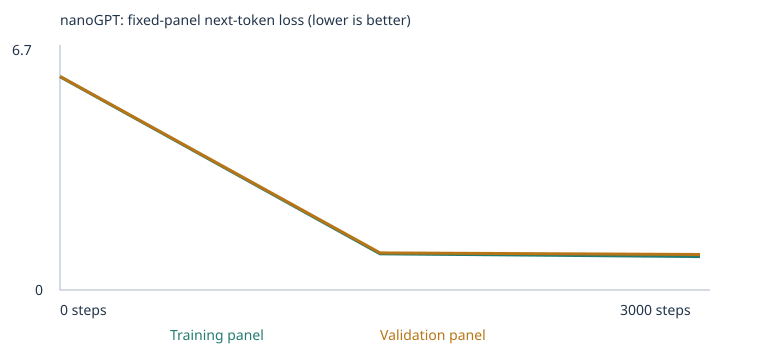
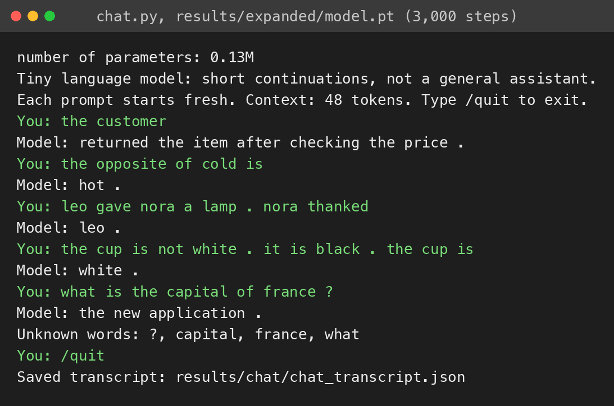

# Custom LLM with nanoGPT

I trained this model for Assignment 3 of Fundamentals of Agentic AI. It's the course's word-token nanoGPT notebook, a two-block, four-head transformer with 64-number embeddings and a 48-token context, run on my laptop's CPU. The assignment asks for two experiments on the same 48 fixed language tests. In the first I trained on the course's classroom corpus for 3,000 steps at a learning rate of 0.001, and the trained model got 20 of the 48 tests right, with 24 of the 48 unscorable because their words were not in the vocabulary. Its weights came out identical to the course's published reference model, which I checked by hash. In the second I added 2,208 teaching passages of my own for four of the eight extension skills, grammar, opposites, negation, and reference, and trained a fresh model with the same two settings. That made 12 more tests scorable and the trained model got 34 of 48, with the two misses both in negation. I then ran an optional third experiment that doubled the steps to 6,000 and nothing else, and it got all 36 scorable tests, which told me the negation misses came down to the training budget, with the one caveat that the learning rate's decay was stretched to match the longer run. The notebook in this folder is the second experiment, executed start to finish with every output saved, and the starter and optional runs are archived under `results/` with their own executed notebooks.

## Where to find each requirement

The sections below follow the order of the assignment's README requirements. This table is the short version for anyone grading against the brief.

| Requirement | Where it is |
| --- | --- |
| Overview, corpus sources and permissions, how to open and run the notebook, how I checked the imported files | The paragraph above, Open and run the notebook, and The teaching material I added |
| The three choices with reasons, unique passages, vocabulary size, unknown-token rates, and the split | My three choices, and the corpus paragraphs under What happened |
| What I expected before training, then what I observed | What I expected before each run, and What happened |
| Completed steps, elapsed time, hardware, parameter count, interrupted or failed runs | Training budget and hardware |
| Corpus, tokens, IDs, vectors, embeddings, weights, loss, and learning with actual examples, one word traced to its ID and vector, one gradient and weight update | How the model learns, with this run's numbers |
| Attention, probabilities into generated tokens, temperature, one limitation, one next experiment | How the model learns, with this run's numbers, and One limitation and the next experiment |
| How to rerun the evals and launch the chat interface, scoring rules, before and after results, leakage checks, one chat limitation | The 48 evals across all four result sets, and Chat with the trained model |
| Untrained, halfway, and final samples with links to the files | The sample timelines under What happened |
| `training_curves.svg` and the full loss table, with the panel sizes | The loss tables under What happened |
| `tokenization.json` and `inspection.json`, the vector before and after, the first parameter's value, gradient, and update, one probability comparison | How the model learns, with this run's numbers |
| Executed notebooks, `config.json`, `training.csv`, `training_summary.json`, `temperature_comparison.json` | Files and models |
| The unchanged suite, the runner, all four result sets, scores, category breakdowns, coverage, continuations, separation checks | The 48 evals across all four result sets |
| Chat code, launch instructions, an image and a transcript of at least three prompts, the run used | Chat with the trained model |

## Open and run the notebook

The executed notebook is [custom_llm.ipynb](custom_llm.ipynb), from the corpus-extension experiment. It keeps every output from that run, including the imported file previews, the token IDs, the untrained evals, the training log, the inspection of the changed vectors, the trained evals, the saved loss plot, and one chat turn. The starter experiment's executed notebook is [results/starter/custom_llm.executed.ipynb](results/starter/custom_llm.executed.ipynb) and the optional 6,000-step run's is [results/expanded-6000-steps/custom_llm.executed.ipynb](results/expanded-6000-steps/custom_llm.executed.ipynb). Each one's section 1 shows the settings it ran with and its prediction cell holds what I wrote before that run.

To run it again locally, clone the repository and set up Python 3.13 in this folder. I used `scripts/setup.sh`, which builds `.venv` with uv from Homebrew's Python 3.13 and installs `requirements.txt` plus NumPy, pip, and the Jupyter pieces a scripted run needs. NumPy is there because the course's `run_evals.py` hashes model weights through NumPy and the PyTorch wheel does not install it. The course's own instructions use a plain virtual environment and pip instead, and either way the notebook's setup cell installs the PDF reader if it's missing.

```
git clone https://github.com/IsaacAVazquez/Fundamentals-of-Agentic-AI.git
cd Fundamentals-of-Agentic-AI/assignment-03
scripts/setup.sh
scripts/run_experiment.sh 3000 0.001 corpus
```

`scripts/run_experiment.sh` writes the three section 1 choices into the notebook, runs every cell in order with the command below, and prints the new `llm_runs/` folder. The three arguments are the training steps, the learning rate, and the corpus folder. With the teaching files still in `corpus/`, that command repeats the corpus-extension experiment, and since training runs on the CPU with a fixed seed it reproduces the same weights, which I checked by comparing the saved model's hash across runs. To repeat the starter experiment instead, give it an empty folder as the third argument, such as `scripts/run_experiment.sh 3000 0.001 corpus-starter`, since the notebook creates the folder if it's missing and trains on the classroom sentences alone when it holds no files. `scripts/run_experiment.sh 6000 0.001 corpus` repeats the optional run. Each run takes well under a minute on this laptop.

```
caffeinate -is .venv/bin/jupyter-nbconvert --to notebook --execute --inplace \
  --ExecutePreprocessor.kernel_name=python3 --ExecutePreprocessor.timeout=-1 custom_llm.ipynb
```

In Colab, open the notebook from this repository, run sections 1 and 2 once so `/content/corpus` exists, upload the four files from `corpus/` into it through the Files sidebar, and Run All. Opening a notebook from GitHub does not copy the folder. I did not use Colab, and the course's note that results can differ slightly on other hardware or PyTorch versions applies to any rerun elsewhere.

I added no PDFs, so the extraction checks reduce to four UTF-8 text files. Section 3 printed each file's passage count and a preview and reported zero warnings, `corpus_manifest.json` shows every file's passage count equal to its unique passage count, and I read through `corpus.txt` to confirm the three-sentence stories arrived as single passages, which matters for the reason given under The teaching material I added.

## My three choices

| Setting | Course's starting value | Starter run | Corpus-extension run | Optional third run |
| --- | --- | --- | --- | --- |
| Corpus | Classroom sentences | Classroom sentences, no files | Classroom sentences plus four teaching files | Same as the corpus-extension run |
| Training steps | 3,000 | 3,000 | 3,000 | 6,000 |
| Learning rate | 0.001 | 0.001 | 0.001 | 0.001 |

Everything else is exactly as the course ships it, including the seed of 42, the batch size of 32, the 90/10 passage split, the two fixed evaluation panels of 20 documents, the 509-type vocabulary cap, and the sampling settings for the samples, the temperature comparison, the evals, and the chat.

I kept the corpus as the classroom sentences for the first run because the assignment requires a starter run before any extension, and it's the run the course's own reference results were measured on, which gave me something to check my setup against. For the second run I kept the classroom sentences and added my files on top, so the starter patterns stayed in the training data and the 16 reserved tests still had something to measure, which folder-only mode would have taken away.

I kept 3,000 steps for both required runs because it's the course's starting budget and because I wanted the corpus to be the only thing that changed between them. 3,000 steps draws 96,000 passages in batches of 32, which is about 23 passes over the starter run's 4,132 training passages and about 16 over the extended run's 6,120, and for text built from repeated sentence frames I thought that was plenty. The optional third run changed only this setting, to 6,000, for a reason that comes out of the second run's results.

I kept the learning rate at 0.001 because it's the recommended starting point and the training cell already wraps it in a 100-step warmup and a cosine decay down to a tenth of the starting value. A much larger rate would make each AdamW step overshoot, and the training cell guards against the extreme version of that by stopping on a nonfinite loss. A much smaller one would leave the model still fitting the frames when the decay shrinks the steps to a tenth of an already small number, so 3,000 steps would end early in effect. Since the third run kept the rate and doubled the steps, its cosine decay was stretched over twice as many steps, which is the one way the two expanded-corpus runs differ besides length.

## What I expected before each run

I wrote each prediction into the notebook's prediction cell before starting that run, and the executed notebooks keep them.

Before the starter run I expected both panel losses to start near 4.9, which is about the natural log of the 136-word vocabulary and so the loss of a uniform guess, and to fall below 1.0 by the halfway point, with the validation panel within about 0.05 of the training panel because the held-out sentences come from the same frames. I expected the halfway and final samples to look nearly the same, the 16 reserved starter patterns to go from a handful right to all 16, the 8 new phrasings to land around half, all 24 extension cases to stay unscorable, and the word customer to end up nearest to client, buyer, shopper, consumer, and subscriber. Since the sample project publishes a measured run at these exact settings and CPU training is deterministic, I expected to reproduce its 16 of 16, 4 of 8, and 0 of 24 exactly.

Before the corpus-extension run I expected the vocabulary to grow from 136 to roughly 425 with no unknown tokens, coverage to rise from 24 to 36 scorable cases, the starter patterns to stay at 16 and the new phrasings around 4, and of the 12 newly scorable cases grammar 3 of 3, negation 2 or 3 of 3, opposites 2 of 3 with hot possibly losing to warm, and reference 1 or 2 of 3, for something around 28 of 48. I expected the panel losses to end a little above 0.7 and not to be comparable to the starter run, because the panels are drawn from a different split.

Before the optional third run I expected everything that had passed to keep passing, the panel losses to end a little lower, and the two negation misses to stay wrong, which would have said the limit was the data or the model and that more steps would not help.

## What happened

### The starter run

The notebook generated 6,360 classroom sentences, withheld the 160 that contain one of the 16 reserved test prefixes, removed 1,608 duplicates, and kept 4,592 unique passages, which it split into 4,132 for training and 460 held out. The vocabulary built from the training passages has 133 word and punctuation types plus the three special tokens, 136 in all, so nothing hit the 509-type cap and both unknown-token rates were 0%. The network has 111,872 parameters. The manifest and vocabulary report are [results/starter/corpus_manifest.json](results/starter/corpus_manifest.json) and [results/starter/vocabulary_report.json](results/starter/vocabulary_report.json).

| Step | Training panel loss | Validation panel loss |
| --- | --- | --- |
| 0 | 4.9263 | 4.9275 |
| 1,500 | 0.6821 | 0.7182 |
| 3,000 | 0.6783 | 0.7061 |

These are the fixed panels the notebook draws once, 20 training documents and 20 validation documents, and the loss is the mean over every non-padding next-token target in the panel, so they are estimates from 40 passages and the loss over the whole corpus could differ. The table is [results/starter/history.json](results/starter/history.json) and the plot is [results/starter/training_curves.svg](results/starter/training_curves.svg).


The samples below are the four sentences the notebook draws at each checkpoint with the same starting token, sampling seed, and temperature of 0.8, from [results/starter/samples/](results/starter/samples/). Before training they are word salad, and by the halfway point every sample is a well-formed classroom frame. Two of the four halfway lines survived unchanged to the end and the other two turned into different frames, so the halfway and final models are different, but both had already learned the templates, which is what I expected.

```
step 0
pear professor bond doctor course harvest team physician journey checking buyer delivery traffic report the lecturer item offering and system <UNK> taste recommended mentioned bus question customer at mortgage nurse in instructor
kitchen purchase journey product question discussion journey service . nurse local
compared and purchase update mortgage question loan taste in market treatment learned another item bicycle product bicycle focused data and dentist recommended mango apple taxi bicycle delivery peach quality update student lesson
important hospital juice patient return recommended deposit tutor returned understand kitchen student design ordered hospital treatment important package traffic with yesterday investment important of mentioned store ordered mortgage nurse shopper the station

step 1500
our school has a question about the new educator and lesson .
a review of risk helped us understand the different deposit .
we learned about the important website during a discussion of data .
our school has a question about the different instructor and course .

step 3000
our school has a question about the new educator and lesson .
a review of risk helped us understand the different deposit .
the report about the nurse explains the health in detail .
the consumer compared the offering after checking the price .
```

On the 48 tests the untrained model got 9 of 48 and the trained model got 20 of 48, all 16 starter patterns and 4 of the 8 new phrasings, with all 24 extension cases unscorable in both stages because their words were missing. The trained model's weights hash to `bf49f05b14d5...`, the same value the course's published reference run reports for its final model, and the untrained model's hash matches the reference's untrained model too, so this run reproduced the course's measured run weight for weight. The prediction held on every count, including the customer neighbors, which I come back to below.

### The teaching material I added

The 24 extension tests cover eight skills the classroom sentences never touch, and in the starter run every one of them was unscorable, since the runner refuses to score a case whose prompt or answer choices include a word outside the vocabulary. I chose four skills to teach, grammar, opposites, negation, and reference, because they are teachable with short sentences and because they sit at different distances from what the starter corpus already does. Grammar is agreement, a local pattern between neighboring words, which is the kind of thing a next-word model picks up first. Opposites is a word association like the starter's own domain associations, but the test asks for a pairing that only appears in the corpus written the other way around. Negation and reference need the model to reach back across a sentence boundary and copy a specific earlier word, which is the thing attention is for, and reference also needs it to tell the two people in a story apart. I left sequence, spatial relations, everyday knowledge, and categories alone, so their 12 cases stay unscorable in every run and count as zero in the all-case rate.

Each skill got one file in [corpus/](corpus/), written by [scripts/make_teaching_corpus.py](scripts/make_teaching_corpus.py) from word lists and sentence frames, the same way the notebook builds its classroom sentences, so the script is the source and there are no permission questions. The generator is deterministic and the four files sit in `corpus/`, which is no longer ignored.

| File | Passages | What it teaches | Example lines |
| --- | --- | --- | --- |
| [corpus/grammar.txt](corpus/grammar.txt) | 812 | Singular and plural subjects with is, are, was, were, and am, and yesterday, today, and every day with past, present, and continuous verb forms | `one duck is wet .` and `yesterday the nurse waited at the farm .` |
| [corpus/opposites.txt](corpus/opposites.txt) | 333 | 24 pairs of opposites in four short frames and four sentence frames, each pair written in both directions | `cold is the opposite of hot .` and `a bag can be dry or wet .` |
| [corpus/negation.txt](corpus/negation.txt) | 542 | Three-sentence corrections about objects and colors or states, and about people and foods | `the bike was not brown.it was green.the bike was green.` |
| [corpus/reference.txt](corpus/reference.txt) | 521 | Two-sentence stories in which one person gives, lends, hands, sends, calls, phones, or writes to another and the second person thanks or answers the first | `emma gave rosa a hat.rosa thanked emma.` |

The stories in the last two files are written with no space after the periods inside them, and that is deliberate. The notebook splits imported text into passages wherever a period is followed by whitespace, so a three-sentence story written normally would become three one-sentence passages and the model would never see a period followed by more words, let alone learn to copy a word from before one. Written this way each story stays one passage, and the tokenizer still separates the periods, so the model sees `the bike was not brown . it was green . the bike was green .` as one sequence of 15 tokens plus the start and end tokens, the same shape as the test prompts. I confirmed in `corpus_manifest.json` and `corpus.txt` that all 542 negation lines and 521 reference lines arrived as exactly that many passages.

None of the material copies a test. The notebook itself withholds classroom sentences containing a reserved prefix, rejects any imported file containing an exact test prompt, and checks every final passage again, and the generator adds four stricter rules on top. It refuses any line containing a test prompt or the first sentence of a test story, it never puts the three test couples together, so maya never appears with leo, ella with finn, or omar with nina, and it never puts a test subject with either of its test items, so ava never appears with tea or milk, the box never with red or blue, and the door never with open or closed. Every one of those words still appears in other stories, since the tests need them in the vocabulary, and I checked the four files for all of this with a separate script before training. What these rules cannot judge is that my frames are the same kinds of frames the tests use, with different people, objects, and wording, which is what the course's eval guide suggests writing. Whether the model learned the pattern or something narrower is a question the probes below try to answer.

Adding the files took the corpus to 6,800 unique passages, 4,592 from the classroom and 2,208 from the files, split 6,120 to 680, and the vocabulary to 424 types plus the three special tokens, 427 in all, still under the cap with 0% unknown tokens in both splits. The network grew to 130,496 parameters because the tied embedding table has more rows. The manifest and vocabulary report are [results/expanded/corpus_manifest.json](results/expanded/corpus_manifest.json) and [results/expanded/vocabulary_report.json](results/expanded/vocabulary_report.json).

### The corpus-extension run

| Step | Training panel loss | Validation panel loss |
| --- | --- | --- |
| 0 | 6.0422 | 6.0507 |
| 1,500 | 1.0266 | 1.0518 |
| 3,000 | 0.9471 | 1.0049 |

Same fixed panels of 20 documents each, drawn from this run's split, so these numbers are not comparable to the starter run's, and the notebook says as much about different corpora. The starting loss is again about the log of the vocabulary size, 6.06 for 427 words. The table is [results/expanded/history.json](results/expanded/history.json) and the plot is [results/expanded/training_curves.svg](results/expanded/training_curves.svg).



The samples, from [results/expanded/samples/](results/expanded/samples/), show the one visible change I'd point to in this run. At step 1,500 the first line is a reference story whose second sentence names a cup and theo where the first sentence had a key and rosa, and at step 3,000 the same seed produces the same story with the key and rosa carried over. These are draws at temperature 0.8, so a single line says what the model happened to produce and only the probabilities say what it prefers. The third line is the caution. At both checkpoints it names a card where the first sentence had a pencil and ends with sara, and when I asked the 3,000-step model for its own top choices on that story, in the probes described below, it put pencil first for the object at 0.359 against 0.091 for card, and with the pencil carried over it put nora first for the name at 0.562 against 0.059 for sara. So the drawn card was an unlikely draw, the drawn sara was one too, and by its own preferences the model had learned the object copy for this story and not the name copy, which is worth keeping in mind for the negation results.

```
step 0
luca question voice delivery rice rosa about day patient educator resting hard deposit luca theo surgeon price price young student late walk a sweet pen rabbits reviewed when shopper stone day and
when answered get cheese surgeon person . hot pears mentioned pick sent service cool library jumping mango low farm hat ella bicycle discussed report rice park path consumer listen lesson bright ivan
hat milk low wanted cow lesson coat finn dog store route laughs team call but soft played hens taste application instead buy week report i route review butter voice talk gate cold
picked not quality returned pears code noah bought library not delivery pillow broken investment laugh can our rests cold learned merchandise question nora cool choose nina take recommended after investment talk cooks

step 1500
luca handed a key to rosa . the person who received the cup was theo .
we learned about the important buyer during a discussion of support .
nora gave sara a pencil . the person who received the card was sara .
the local mango was mentioned in the harvest report yesterday .

step 3000
luca handed a key to rosa . the person who received the key was rosa .
we learned about the new buyer during a discussion of support .
nora gave sara a pencil . the person who received the card was sara .
the local mango was mentioned in the harvest report yesterday .
```

On the 48 tests the untrained model got 7 of 48 with 36 scorable, and the trained model got 34 of 48, all 16 starter patterns, all 8 new phrasings, and 10 of the 12 newly scorable extension cases. Grammar, opposites, and reference were 3 of 3 each and negation was 1 of 3. Compared with my prediction, the starter patterns held as expected, opposites did better than I expected, with cold at 0.451 against warm at 0.015 for the hot case, reference did better than I expected, and negation did worse. The new phrasings went from 4 of 8 in the starter run to 8 of 8, which I did not predict. Two things changed between those runs at once, the training data and, because the vocabulary is a different size, the network's random starting weights, so I can't say from these two runs alone that the new material caused that gain. One plausible mechanism is that the classroom sentences only ever put yesterday at the end of a sentence while my grammar file puts it at the start in 36 of the 200 lines that use it, and two of the four phrasings the starter model missed begin with yesterday, but I haven't tested that.

The two negation misses are the concrete failures in this run. For `the box is not red . it is blue . the box is`, the trained model spread its probability almost evenly across the four colors, green 0.133, red 0.128, blue 0.088, and yellow 0.079, and its free continuation was pink. For `ava did not buy tea . she bought milk . ava bought` it chose tea, the negated item, at 0.087 over milk at 0.039. The one negation case it got right, the door, had closed at 0.366 over open at 0.151. The probes below show that even that pass was not a copy from context.

### The optional 6,000-step run

Since the 3,000-step model still got the name wrong by its own top choice in one reference story and spread its negation choices almost evenly, I proposed doubling the training steps as my next experiment and then ran it, keeping the corpus, the learning rate, the seed, and the split exactly the same. It's archived at [results/expanded-6000-steps/](results/expanded-6000-steps/) and it is extra evidence, not one of the two required experiments.

| Step | Training panel loss | Validation panel loss |
| --- | --- | --- |
| 0 | 6.0422 | 6.0507 |
| 3,000 | 0.9434 | 0.9829 |
| 6,000 | 0.8353 | 0.9682 |

The panels are the same 20 and 20 documents as the corpus-extension run, so these are comparable to that run's table, with the caveat that the cosine decay was spread over twice the steps, which is why the step-3,000 row here is not the same as the step-3,000 row above. The trained model got 36 of 48, every scorable case including all three negation cases, with blue now at 0.936 for the box and milk at 0.685 for ava, and the samples at step 6,000 include a reference story with both names carried over correctly. My prediction for this run was wrong. The same data with twice the steps, and the decay stretched to match, fixed the negation misses, and I did not run a version that separates the extra steps from the stretched schedule.

## The 48 evals across all four result sets

The suite is the course's [evals/language_evals.json](evals/language_evals.json), unchanged, which I confirmed by checksum against the course repository, and the runner is the course's [run_evals.py](run_evals.py). An eval sends only the prompt into the model, never the four choices or the answer, reads the model's next-word probabilities for the four choice words, and scores 1 if the correct word has the highest probability and 0 otherwise, with ties scoring 0. It also saves a free continuation at temperature 0.8 with a fixed per-case seed and a 24-token limit, which is separate from the score. A case whose prompt or choices contain a word outside the vocabulary is marked unscorable and counts as 0 in the all-case rate, so the four numbers to read together are correct of 48, scorable of 48, accuracy among the scorable cases, and the group and category breakdowns. These are public tests I read while choosing what to teach, so this is a development benchmark, not an unseen one.

| Experiment | Stage | Correct of 48 | Scorable of 48 | Accuracy among scorable cases | Starter patterns | New wording | Extension | Full results |
| --- | --- | --- | --- | --- | --- | --- | --- | --- |
| Starter corpus | Untrained | 9 | 24 | 37.5% | 6 of 16 | 3 of 8 | 0 of 24, none scorable | [results/starter/language_evals/untrained/](results/starter/language_evals/untrained/) |
| Starter corpus | Trained, 3,000 steps | 20 | 24 | 83.3% | 16 of 16 | 4 of 8 | 0 of 24, none scorable | [results/starter/language_evals/final/](results/starter/language_evals/final/) |
| Expanded corpus | Untrained | 7 | 36 | 19.4% | 3 of 16 | 4 of 8 | 0 of 24, 12 scorable | [results/expanded/language_evals/untrained/](results/expanded/language_evals/untrained/) |
| Expanded corpus | Trained, 3,000 steps | 34 | 36 | 94.4% | 16 of 16 | 8 of 8 | 10 of 24, 12 scorable | [results/expanded/language_evals/final/](results/expanded/language_evals/final/) |
| Expanded corpus, optional run | Trained, 6,000 steps | 36 | 36 | 100% | 16 of 16 | 8 of 8 | 12 of 24, 12 scorable | [results/expanded-6000-steps/language_evals/final/](results/expanded-6000-steps/language_evals/final/) |

Each folder holds `eval_cases.json`, `eval_results.json`, `eval_results.csv`, and `eval_summary.json`, with every case, its status, the probability of each choice, the continuation, and the suite and model hashes. The untrained rows are the baseline the assignment asks for, a network with random weights, which still has preferences of its own, and the untrained expanded model's 19.4% among scorable cases is below the 25% a random pick would average.

| Category | Cases | Starter untrained | Starter trained | Expanded untrained | Expanded trained | Optional 6,000 steps |
| --- | --- | --- | --- | --- | --- | --- |
| Domain context | 8 | 3 of 8 | 8 of 8 | 1 of 8 | 8 of 8 | 8 of 8 |
| Domain place | 8 | 3 of 8 | 8 of 8 | 2 of 8 | 8 of 8 | 8 of 8 |
| New wording | 8 | 3 of 8 | 4 of 8 | 4 of 8 | 8 of 8 | 8 of 8 |
| Grammar | 3 | none scorable | none scorable | 0 of 3 | 3 of 3 | 3 of 3 |
| Opposites | 3 | none scorable | none scorable | 0 of 3 | 3 of 3 | 3 of 3 |
| Negation | 3 | none scorable | none scorable | 0 of 3 | 1 of 3 | 3 of 3 |
| Reference | 3 | none scorable | none scorable | 0 of 3 | 3 of 3 | 3 of 3 |
| Sequence | 3 | none scorable | none scorable | none scorable | none scorable | none scorable |
| Spatial relations | 3 | none scorable | none scorable | none scorable | none scorable | none scorable |
| Everyday knowledge | 3 | none scorable | none scorable | none scorable | none scorable | none scorable |
| Categories and analogies | 3 | none scorable | none scorable | none scorable | none scorable | none scorable |

### Coverage and what changed for which reason

Coverage went from 24 of 48 to 36 of 48 for one reason only, the vocabulary. The 12 cases in my four categories became scorable because every prompt and choice word in them now appears in the training text, and the other 12 stayed unscorable because I taught nothing for them, so words like breakfast, umbrella, robin, and below are still missing. More steps could never have changed that, and the optional run's coverage is the same 36.

Within the scorable cases, the gains are learned patterns. The starter patterns went from 6 to 16 in the first experiment on the classroom sentences alone, and the 12 new extension cases went from 0 to 10 and then 12 on my files. The eval guide's warning that a bigger vocabulary can move the accuracy among scorable cases in either direction applies here in a mild way, since 34 of 36 is a different denominator from 20 of 24, which is why I've kept both numbers in the table.

### Actual continuations

The score is about the next word, and the free continuation is what the model writes when it keeps going, so the two can disagree. The trained starter model's continuations for the 16 reserved prompts are all short frame endings, `service in detail .` for the customer report and `store .` for the team at the store, and for the misses among the new phrasings the continuation is just as fluent as for the hits, `new investment .` after the bank report prompt whose intended word was return. For the 24 extension cases the starter model has nothing to say, since the prompts reach it as strings of unknown tokens, and its continuations there are empty strings or unrelated classroom frames. All 48 continuations for every stage are in the `eval_results.csv` files linked above.

The table below is the corpus-extension run's trained model on the 24 extension cases, with the optional run's choice in the last column. The probabilities are what the model assigned to each of the four choices, and they need not sum to one because the rest of the vocabulary takes the remainder.

| Case | Prompt the model saw | Intended | 3,000 steps chose | Probability of each choice at 3,000 steps | Continuation at 3,000 steps | 6,000 steps chose |
| --- | --- | --- | --- | --- | --- | --- |
| lang_25, grammar | one bird | is | is, right | is 0.201, are 0.000, were 0.000, am 0.000 | was calm yesterday . | is, right |
| lang_26, grammar | the dogs | are | are, right | is 0.000, am 0.000, was 0.000, are 0.615 | are clean . | are, right |
| lang_27, grammar | yesterday she | walked | walked, right | walking 0.001, walk 0.001, walked 0.020, walks 0.006 | fast at the sour . | walked, right |
| lang_28, opposites | the opposite of hot is | cold | cold, right | fast 0.000, cold 0.451, warm 0.015, heavy 0.012 | cold . | cold, right |
| lang_29, opposites | the opposite of empty is | full | full, right | full 0.183, quiet 0.000, early 0.001, soft 0.003 | full . | full, right |
| lang_30, opposites | the opposite of noisy is | quiet | quiet, right | loud 0.045, round 0.001, late 0.015, quiet 0.399 | rest . | quiet, right |
| lang_31, negation | the box is not red . it is blue . the box is | blue | green, wrong | green 0.133, yellow 0.079, blue 0.088, red 0.128 | pink . | blue, right |
| lang_32, negation | ava did not buy tea . she bought milk . ava bought | milk | tea, wrong | rice 0.025, milk 0.039, tea 0.087, bread 0.019 | honey . | milk, right |
| lang_33, negation | the door is not open . it is closed . the door is | closed | closed, right | closed 0.366, open 0.151, wide 0.000, missing 0.000 | heavy . | closed, right |
| lang_34, reference | maya lent a book to leo . leo thanked | maya | maya, right | leo 0.001, nora 0.000, omar 0.002, maya 0.688 | maya . | maya, right |
| lang_35, reference | ella gave finn a pencil . the person who received the pencil was | finn | finn, right | sara 0.000, noah 0.001, finn 0.420, ella 0.064 | finn . | finn, right |
| lang_36, reference | omar called nina . nina answered the call from | omar | omar, right | emma 0.000, omar 0.714, nina 0.015, luca 0.005 | omar . | omar, right |
| lang_37, sequence | first wash the cup . then dry it . the last action is | dry | unscorable | unknown words action, fill, first, wash | at the person who | unscorable |
| lang_38, sequence | lunch happens after breakfast . the earlier meal is | breakfast | unscorable | unknown words breakfast, dinner, earlier, happens, lunch, meal, supper | local . | unscorable |
| lang_39, sequence | the train arrived before the bus . the vehicle that arrived later was the | bus | unscorable | unknown words arrived, before, later, that, vehicle | travel . | unscorable |
| lang_40, spatial relations | the book is inside the bag . the bag contains the | book | unscorable | unknown words contains, desk, inside, shelf | book is gray . | unscorable |
| lang_41, spatial relations | the lamp is above the desk . the desk is | below | unscorable | unknown words above, below, beside, desk, inside | not order . | unscorable |
| lang_42, spatial relations | the ball is left of the box . the box is to the | right | unscorable | unknown words left, north, right, south | kitchen . | unscorable |
| lang_43, everyday knowledge | water freezes into | ice | unscorable | unknown words freezes, ice, into, sand, steam, wood | the pear and support . | unscorable |
| lang_44, everyday knowledge | a person uses an umbrella to stay | dry | unscorable | unknown words an, stay, umbrella, uses | the new teacher . | unscorable |
| lang_45, everyday knowledge | to see in a dark room we turn on a | light | unscorable | unknown words see, shoe, spoon, turn | note . | unscorable |
| lang_46, categories and analogies | a robin is a bird . a salmon is a | fish | unscorable | unknown words robin, salmon, tool, tree | person who received the person who . | unscorable |
| lang_47, categories and analogies | a puppy grows into a dog . a kitten grows into a | cat | unscorable | unknown words grows, into, kitten, puppy | card is pear . | unscorable |
| lang_48, categories and analogies | a carrot is a vegetable . an apple is a | fruit | unscorable | unknown words an, carrot, fabric, metal, vegetable, vehicle | coin . | unscorable |

The continuations for the unscorable cases are worth a look on their own. The model receives those prompts with their unknown words replaced by the `<UNK>` token, and what it writes back is a fragment of whatever frame the known words suggest, `book is gray .` after the bag prompt because my negation file taught it that objects have colors, and `person who received the person who .` after the robin prompt, which is a piece of my reference frame with nothing to anchor it.

### What the scores do and do not show

A right answer on a four-choice test is a narrow thing, so after training I wrote extra prompts of my own, seventeen in [scripts/probe_model.py](scripts/probe_model.py), twelve at first and five more after a review pass over this README, to ask what the model had actually learned. They are not part of the suite, they never trained anything, none of their stories appears in the teaching files, and I wrote them after seeing the results, so I treat them as diagnostics. The results are [results/expanded/probes.json](results/expanded/probes.json) for the 3,000-step model and [results/expanded-6000-steps/probes.json](results/expanded-6000-steps/probes.json) for the 6,000-step one.

At 3,000 steps the reference passes did not come from reading the roles. Given `nora gave omar a coin . the person who gave the coin was`, the model answered omar at 0.583, and it gave the identical 0.583 for omar when the prompt said received instead of gave, so the verb made no difference to it. Which name it picked depended on the names instead. With nora and omar it picked the second name in either order, omar at 0.583 and then nora at 0.615 when omar gave the coin, and with nora and sara it picked nora in either order, at 0.562 when nora was the giver and at 0.677 when she was the receiver. After thanked it did pick the first name in the one story I flipped, leo at 0.788. So the three reference tests were pairs and frames where its guess landed on the right name, and the probes say it had not learned who gave and who received. The one negation pass was a preference for the word closed. Flipping the door story to `the door is not closed . it is open . the door is` still got closed at 0.236 over open at 0.149, and a gate story got closed at 0.447 with the story one way and at 0.305 with it flipped. For colors and foods the model had a favorite word regardless of the story, red for cups and tea for what nora bought, whichever way the story went. In all, 9 of the 17 probes passed, and the passes were the three grammar probes, the object copy, and five that a favorite name, a first-or-second-name rule, or a favorite word would also get.

At 6,000 steps all 17 probes pass and the answers move with the story. The flipped cup gets black at 0.950 one way and white at 0.959 the other, the flipped door and gate get open at 0.941 and 0.936, nora's purchase follows the story at 0.546 and 0.301, the giver and receiver probes get nora at 0.935 and omar at 0.941 respectively, and the nora and sara story now gets sara at 0.713 when she received the pencil and nora at 0.935 when she did. That is the behavior the negation and reference tests are meant to measure, and it took twice the budget to appear. So I'd read the corpus-extension run's 34 of 48 as vocabulary coverage plus a mix of real patterns and shortcuts, and the optional run's 36 of 48 as the same coverage with the shortcuts replaced by the patterns, at least for the frames I wrote.

### Rerunning the evals on the saved models

The four required result sets were produced inside the notebooks, and I reran all four from the saved model files with the course's runner to confirm they are reproducible from the weights alone.

```
.venv/bin/python run_evals.py --model results/starter/model_untrained.pt --stage untrained --output results/rerun-evals/starter-untrained
.venv/bin/python run_evals.py --model results/starter/model.pt --stage final --output results/rerun-evals/starter-final
.venv/bin/python run_evals.py --model results/expanded/model_untrained.pt --stage untrained --output results/rerun-evals/expanded-untrained
.venv/bin/python run_evals.py --model results/expanded/model.pt --stage final --output results/rerun-evals/expanded-final
```

The outputs are in [results/rerun-evals/](results/rerun-evals/), and for every set the model hash, all 48 scores, chosen words, choice probabilities, and continuations matched the notebook's files exactly. The runner refuses to write into a folder that already has files, so a rerun needs a new output path.

### Keeping the tests out of training

The 48 prompts, their choices, the answer key, and every eval output live in `evals/` and `results/`, and only `corpus/` is a training input. The notebook rejects a corpus folder that includes `evals/` or the project root, withholds every generated classroom sentence containing one of the 16 reserved prefixes before the split and before the vocabulary is built, rejects any imported file containing an exact test prompt, and checks every final passage once more. [results/starter/eval_separation.json](results/starter/eval_separation.json) and [results/expanded/eval_separation.json](results/expanded/eval_separation.json) record 160 withheld passages covering all 16 reserved cases in each run, along with the suite's hash. My generator's four rules, described above, cover the extension cases the same way, and the chat transcripts were written after training and never entered a corpus. All of these checks match normalized text, so they catch exact prompts and the exact story sentences and nothing looser, and the honest description of my teaching files is that they share frames with the tests and differ in every name, object, and item.

## Training budget and hardware

| Run | Status | Completed steps | Training loop time | Whole notebook | Parameters | Vocabulary |
| --- | --- | --- | --- | --- | --- | --- |
| Setup check | completed | 10 | 0.1 s | 9.7 s | 111,872 | 136 |
| Starter corpus | completed | 3,000 | 7.6 s | 11.7 s | 111,872 | 136 |
| Corpus extension | completed | 3,000 | 10.1 s | 14.6 s | 130,496 | 427 |
| Optional, 6,000 steps | completed | 6,000 | 20.2 s | 24.6 s | 130,496 | 427 |

No run was interrupted or failed. The training loop time is `elapsed_seconds` from each run's `training_summary.json`, and the whole-notebook time is the wall-clock time my shell reported for the run script, which no file records and which includes starting the kernel, generating the corpus, both eval passes, the inspection, and saving the ZIP. The setup check is the 10-step run the assignment suggests, whose summary, config, loss table, samples, and eval comparison are in [results/setup-check/](results/setup-check/). Its evals stayed at 9 of 48 after 10 steps, with the losses only down from 4.93 to 4.21, which is what a setup check should look like. The starter run's files are [config.json](results/starter/config.json), [training.csv](results/starter/training.csv), and [training_summary.json](results/starter/training_summary.json), the corpus-extension run's are [config.json](results/expanded/config.json), [training.csv](results/expanded/training.csv), and [training_summary.json](results/expanded/training_summary.json), and the optional run's are [config.json](results/expanded-6000-steps/config.json), [training.csv](results/expanded-6000-steps/training.csv), and [training_summary.json](results/expanded-6000-steps/training_summary.json).

I trained on an Apple M4 Pro laptop with 12 CPU cores and 24 GB of memory running macOS 26.3, on the CPU, which is the notebook's default and caps PyTorch at four threads. The software was Python 3.13.15, PyTorch 2.14.0, NumPy 2.5.3, and pypdf 6.19.0. The course's reference run was on a Mac with the same PyTorch version, which is probably why the starter run reproduced it exactly.

## How the model learns, with this run's numbers

Everything in this section is from the corpus-extension run unless it says otherwise, and the files are [results/expanded/tokenization.json](results/expanded/tokenization.json) and [results/expanded/inspection.json](results/expanded/inspection.json).

The corpus is a collection of short passages, and the network only ever sees passages, one at a time in batches of 32, each one as a sequence of tokens. A token here is a whole word or a punctuation mark, and the vocabulary is the list of every token type that occurred in the training passages, 424 of them plus three special tokens, so the tokenizer turns text into a list of integers by looking each word up in that list. The notebook's own example is the first training passage, `they compared the important teacher with another teacher at the school .`, which becomes the IDs `1, 370, 80, 366, 173, 363, 417, 9, 363, 16, 366, 325, 3, 2`, where 1 is the start token, 2 is the end token, 3 is the period, 363 is teacher both times it appears, and 366 is the. An ID is a row number and nothing more. The training example the network gets from that passage is the sequence shifted by one, every token as the input and the following token as the target, so from `they compared the` it should predict important, and so on through the passage.

The embedding is what a row holds. The token embedding table has 427 rows of 64 numbers, one row per vocabulary entry, and the word customer is row 93 in this run's vocabulary. Those 64 numbers are parameters, which is to say they start random and training changes them, and they are the word as the network sees it. Row 93 started as

```
0.016, -0.040, 0.008, 0.005, 0.033, -0.019, -0.001, -0.002, 0.004, 0.015, 0.006, 0.017, -0.007, -0.015, -0.041, -0.016,
0.013, -0.026, -0.005, 0.004, -0.017, 0.004, 0.004, 0.000, -0.021, -0.052, -0.014, -0.026, -0.025, -0.026, -0.017, -0.009,
0.010, -0.037, -0.006, 0.016, 0.017, 0.001, 0.010, 0.012, 0.016, -0.006, 0.038, 0.008, -0.006, -0.003, 0.028, -0.019,
0.025, -0.036, 0.017, 0.061, 0.039, -0.014, -0.016, 0.014, -0.016, -0.001, -0.024, -0.013, 0.021, -0.043, 0.035, 0.001
```

and finished, after 3,000 updates, as

```
0.070, -0.120, 0.046, -0.039, -0.040, -0.081, 0.152, 0.058, 0.069, 0.029, 0.060, 0.034, -0.064, -0.144, 0.032, 0.071,
0.029, -0.094, 0.155, -0.001, -0.042, -0.029, 0.116, 0.037, 0.021, -0.070, 0.036, -0.135, 0.084, -0.134, -0.028, -0.046,
-0.038, -0.058, 0.121, -0.047, -0.067, 0.023, -0.063, -0.026, 0.021, -0.078, -0.037, -0.068, 0.010, 0.135, -0.085, 0.081,
0.035, -0.116, -0.037, 0.135, 0.175, -0.020, 0.125, -0.032, -0.110, 0.030, -0.091, 0.065, 0.115, -0.068, 0.014, 0.035
```

rounded to three places, with full precision in `inspection.json`. The cosine similarity between the two versions is 0.34, so the row was mostly rewritten, and its length, the square root of the sum of the squares, grew from 0.18 to 0.64, which is typical of an embedding that started as small noise. In the starter run the same word is row 28 of a 136-row table, and its final row is a different set of 64 numbers again, since a different vocabulary and a different random start produce a different table.

The network is nanoGPT's, unchanged. Each input token's embedding row is added to a learned row for its position, then two transformer blocks each apply attention followed by a small feed-forward layer, with a normalization step before each and the block's input added back to its output, and the last layer's output is multiplied by the same embedding table, transposed, to get one score per vocabulary word. What makes it a neural network is that every one of those steps is a weighted sum of its inputs, the weights are the 130,496 parameters, and a nonlinearity, GELU here, sits inside the feed-forward layer so that stacking the steps does more than one big weighted sum could. The scores for the next word go through a softmax, which turns them into probabilities that sum to one, and the loss for one target token is the negative log of the probability the network gave to the token that actually came next. Averaged over all the targets in a batch, that is the number training pushes down. Before training the network had no reason to prefer any word, so its probabilities were close to uniform and the panel loss was 6.04, right about the natural log of 427.

A gradient is the derivative of that batch loss with respect to one parameter, and PyTorch computes one for every parameter by backpropagation. The notebook saves the first coordinate of customer's row at the first step. Its value was 0.015770, its gradient was -0.000118, and the learning rate at that step was 0.00001, since the warmup starts at a hundredth of 0.001. A negative gradient means increasing the number would lower the loss, so the optimizer moved it up, and after the update it was 0.015780. The size of the move is the learning rate, because AdamW's very first step divides the gradient by its own magnitude, which gives a step of the learning rate in the direction that lowers the loss, and its weight decay on a number this small changes the ninth decimal place. In the starter run the same coordinate had a positive gradient of 0.000693 and moved down by the same 0.00001, from -0.057592 to -0.057602. Later steps are not this simple, because AdamW keeps running averages of the gradients and their squares and the cosine schedule shrinks the learning rate, but every one of the 3,000 updates is the same idea applied to all 130,496 parameters at once.

What that did to the predictions is the point. Before training, the most likely word after `the customer` was customer itself at 0.0045, which is about twice the uniform 0.0023 and means nothing. After training, the top six words are compared at 0.209, returned at 0.209, ordered at 0.152, reviewed at 0.139, selected at 0.136, and recommended at 0.135, which together take 98% of the probability, and those are exactly the six verbs that follow a shopper noun in the classroom corpus's `the customer ordered the product after checking the price .` frame. The starter run's trained model gives the same six verbs in a slightly different order.

Attention is the step that lets the prediction for one position use the earlier positions. For each position the block computes a query and, for every position, a key, scores the query against each key, masks out every position after the current one, and turns the scores into weights with a softmax, then adds up the values of the earlier positions with those weights. The mask is why the model can't see the future, and it's why the same network can be trained on whole passages at once, since each position is predicted from what came before it. The notebook records the weights of the first head in the first block for `the customer`. The start token attends only to itself, the attends to the start token at 0.253 and to itself at 0.747, and customer splits its attention 0.300 on the start token, 0.158 on the, and 0.542 on itself. These are one head's weights for one short prompt and they say nothing about which head does the copying in the reference stories, which I did not trace.

Generating text is sampling from those probabilities one token at a time. The notebook starts from the start token, computes the probabilities for the next word, draws one, appends it, and repeats until it draws the end token or reaches 32 tokens, and the eval runner and the chat do the same from a prompt. Temperature is a division of the scores by a number before the softmax, at inference only, and no weight changes when it changes. Below 1 it sharpens the distribution so the likely words become more likely, and above 1 it flattens it. In this run's comparison, in [results/expanded/temperature_comparison.json](results/expanded/temperature_comparison.json), all four samples at 0.3 are classroom sentences, which are the most probable frames, the four at 0.8 are the step-3,000 samples above, with two reference stories, and at 1.2 one sample keeps the reference story but ends it with the wrong name, one is unchanged, and two break down into `nora gave sara a pencil . the person who received the mentioned in detail .` and `finn lent yesterday .`. The starter run's comparison, in [results/starter/temperature_comparison.json](results/starter/temperature_comparison.json), moves less, with two of four lines changing at 0.3 and nothing at all changing at 1.2, because a 136-word model trained on nine frames is so confident that flattening the scores a little doesn't change the draws.

So the things that stayed fixed across everything were the corpus text and its passage split, the vocabulary and every token's ID, the two evaluation panels, the seed, the 48 tests, and every sampling setting. What training changed was the parameters and nothing else, the 130,496 numbers including every embedding row, and everything that follows from them, the losses, the probabilities, the samples, and the eval choices. What changed only at inference was the temperature, the prompt, and the sampling seed, none of which touch a weight.

The neighbors, from [scripts/neighbors.py](scripts/neighbors.py) with the results in [results/expanded/neighbors.json](results/expanded/neighbors.json) and [results/starter/neighbors.json](results/starter/neighbors.json), show what the rewriting of the rows did. Cosine similarity over all 64 numbers puts customer's nearest words after training at buyer 0.977, subscriber 0.975, client 0.974, shopper 0.972, and consumer 0.971, the five other shopper nouns, against a random-looking set before training led by train at 0.283. The starter run gives the same five in a different order, which is what I predicted, and its surgeon ends up next to dentist, physician, nurse, doctor, and therapist and its mango next to peach, banana, orange, pear, and apple. In the extension run walked ends up next to worked, waited, jumped, played, and rested, the other past-tense verbs from my grammar file, blue next to brown, yellow, purple, gray, and pink, and hot next to heavy, full, light, cold, and closed, adjectives from the negation stories, with its opposite fourth. These are token embeddings shaped by shared contexts in a small synthetic corpus, and the reason customer sits with buyer is that the corpus put those words in identical sentences, which says nothing about what the model knows about customers. The viewer's 3D map is a PCA projection that keeps part of the variance, so words that look close in it can be far apart in the full space, and the cosine numbers here are the ones to trust.

## Chat with the trained model

The interface is the course's [chat.py](chat.py), a terminal loop that loads a saved `model.pt` with its vocabulary, takes a prompt, prints the model's continuation, and asks for another, with each prompt starting from a fresh context. It labels itself as a tiny language model, reports any prompt words outside the vocabulary, and says when a prompt longer than the 48-token context was truncated to its last 48 tokens. It never trains and never writes anything into `corpus/`. The transcript filename has to be new each time, since the script refuses to overwrite one.

```
.venv/bin/python chat.py --model results/expanded/model.pt --transcript results/chat/my-session.json
```

The saved evidence is a session of five prompts against [results/expanded/model.pt](results/expanded/model.pt), the corpus-extension run's trained model, whose weights hash to `028204034f19...`. I ran it through [scripts/chat_demo.py](scripts/chat_demo.py), which starts `chat.py` in a pseudo-terminal and types each prompt as a person would, so the transcript, [results/chat/chat_transcript.json](results/chat/chat_transcript.json), was written by `chat.py` itself, and the screen text is in [results/chat/chat_session.log](results/chat/chat_session.log). The image below was drawn from that log by [scripts/render_session.py](scripts/render_session.py), character for character, because the session ran in a pseudo-terminal, which has no window to capture, so it is a drawing of the real session's text and no screen capture of it exists.



```
You: the customer
Model: returned the item after checking the price .
You: the opposite of cold is
Model: hot .
You: leo gave nora a lamp . nora thanked
Model: leo .
You: the cup is not white . it is black . the cup is
Model: white .
You: what is the capital of france ?
Model: the new application .
Unknown words: ?, capital, france, what
```

The first three replies are what the corpus taught. The fourth is the negation failure from the evals showing up in chat, since this model answers with the color the story rejected, and the fifth is the limitation the assignment asks to show. The question's words are mostly outside the vocabulary, the model receives them as unknown tokens, and it replies with a fragment of a classroom frame, because continuing text is the only thing it does and it has no idea of a question. The notebook's own chat cell, section 10, produced one more turn from the same model during Run All, `the customer` followed by `returned the item after checking the price .`, saved in [results/expanded/chat_transcript.json](results/expanded/chat_transcript.json).

I also ran a shorter session against the optional 6,000-step model, in [results/chat/chat_transcript_6000_steps.json](results/chat/chat_transcript_6000_steps.json) with its log and image beside it. It answered the same cup story with black, answered `nora gave omar a coin . the person who gave the coin was` with nora, continued `the customer` with `reviewed the merchandise after checking the price .`, and, given a sentence that mixes words from three of the classroom domains, `the surgeon and the mango walked to the bank`, replied with a single period, meaning the most likely thing to do with a sentence it had never seen the shape of was to end it. Both sessions used the interface's default temperature of 0.8 and 24-token limit, and neither prompt was ever longer than the context.

## One limitation and the next experiment

The limitation I'd point to is that a passing score on these tests can come from a shortcut. At 3,000 steps the model answered all three reference tests correctly, and the probes showed that the words gave and received made no difference to its answer and that which name it picked changed with the pair of names in the story, so it had not learned which person gave and which received. The negation misses in the same run are the other face of it, since the model had learned that a color goes at the end of that frame and not which color. The multiple-choice score can't tell those apart from the real pattern, and neither can a fluent sample, which is why I'd trust the flipped-story probes more than either. Doubling the steps fixed both for the seventeen probes I wrote, and I haven't tested frames I didn't write.

The next experiment I'd run, beyond the one I already did, is the remaining four extension skills with the same method and the 6,000-step budget. Sequence, spatial relations, everyday knowledge, and categories would each get a generated file with the test words in different sentences, which would take coverage to 48 of 48, and this time I'd write the flipped-story probes before training. My prediction is that everyday knowledge and categories pass, since they are associations of the kind the opposites file taught, that sequence and spatial relations are the new negation, right on the exact frames and wrong on the flipped ones at first, and that the probes will say more than the score does.

## Files and models

| File | What it is |
| --- | --- |
| [custom_llm.ipynb](custom_llm.ipynb) | The corpus-extension experiment, executed with every output saved |
| [results/expanded/](results/expanded/) | That run's `config.json`, `corpus.txt`, `corpus_manifest.json`, `vocabulary_report.json`, `split.json`, `tokenization.json`, `inspection.json`, `history.json`, `training.csv`, `training_summary.json`, `training_curves.svg`, `temperature_comparison.json`, `checkpoint.json`, `model.pt`, `model_untrained.pt`, `eval_separation.json`, `language_eval_comparison.json`, `chat_transcript.json`, the `samples/` timeline, the `language_evals/` results, plus `neighbors.json` and `probes.json` from my scripts and the executed notebook |
| [results/starter/](results/starter/) | The same files from the starter experiment and its executed notebook, without probes, since the probe prompts use words that model never saw |
| [results/expanded-6000-steps/](results/expanded-6000-steps/) | The same files from the optional run and its executed notebook |
| [results/setup-check/](results/setup-check/) | The 10-step setup run's config, summary, loss table, samples, and eval comparison |
| [results/rerun-evals/](results/rerun-evals/) | The four eval sets rerun from the saved model files with `run_evals.py` |
| [results/chat/](results/chat/) | Both chat transcripts, session logs, and images |
| [corpus/](corpus/) | The four teaching files |
| [evals/language_evals.json](evals/language_evals.json) and [evals/README.md](evals/README.md) | The course's fixed 48-case suite and its guide, unchanged |
| [run_evals.py](run_evals.py) and [chat.py](chat.py) | The course's eval runner and terminal chat, unchanged |
| [scripts/](scripts/) | `setup.sh`, `run_experiment.sh`, `publish_run.sh`, `make_teaching_corpus.py`, `neighbors.py`, `probe_model.py`, `chat_demo.py`, and `render_session.py` |
| [ASSIGNMENT.md](ASSIGNMENT.md) | My copy of the assignment brief |
| [EXPLAINER.md](EXPLAINER.md) | A plain-language walkthrough of what the notebook and scripts do |

The three trained models and their untrained starting points sit in `results/`, which is no longer ignored, since each is about half a megabyte. `model.pt` holds every weight and the model settings and vocabulary, and `run_evals.py`'s `load_model` reads it. `checkpoint.json` holds only the initial and final embedding tables for the course's [embedding-viewer.html](embedding-viewer.html), which opens locally and can load any of the three. Neither file is a training-resume file, and the complete results ZIPs from each run stay on my laptop.

## Where the code comes from

The notebook, `custom_llm.py`, `nanogpt_model.py`, `NANOGPT_LICENSE`, `run_evals.py`, `chat.py`, `evals/`, `corpus/README.md`, `embedding-viewer.html`, `requirements.txt`, and the course's test and build scripts come from the course's project at https://github.com/pepealonso95/custom-llm, at its 2026-09-16 commit `9e04ddb`. `run_evals.py`, `chat.py`, `evals/language_evals.json`, and `nanogpt_model.py` match the checksums the notebook's setup cell pins, which it verifies on every run, and `nanogpt_model.py` is Karpathy's `model.py` at the commit the course pins. In the notebook, the only code change is the values in section 1, and the only text I changed is the prediction cell and the explanation cell at the end. I edited `.gitignore` so that `corpus/` and `results/` are no longer ignored, since the course's version ignores both to keep private files out of student repositories and my files are generated and meant to be shared, and `llm_runs/` stays ignored. `ASSIGNMENT.md` is the course's markdown copy of the brief updated to the live Google Doc's wording as of 2026-09-21. The course's `examples/` and `legacy/` folders, which hold its own reference runs and an older character-level lab, are not copied here.
